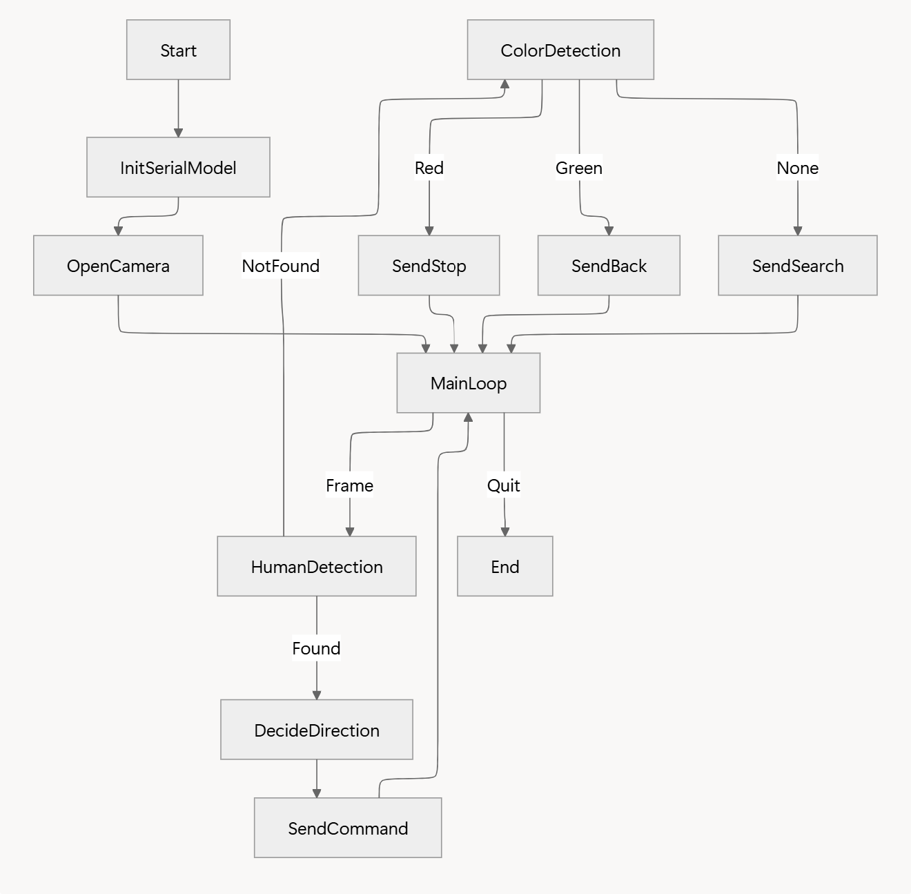
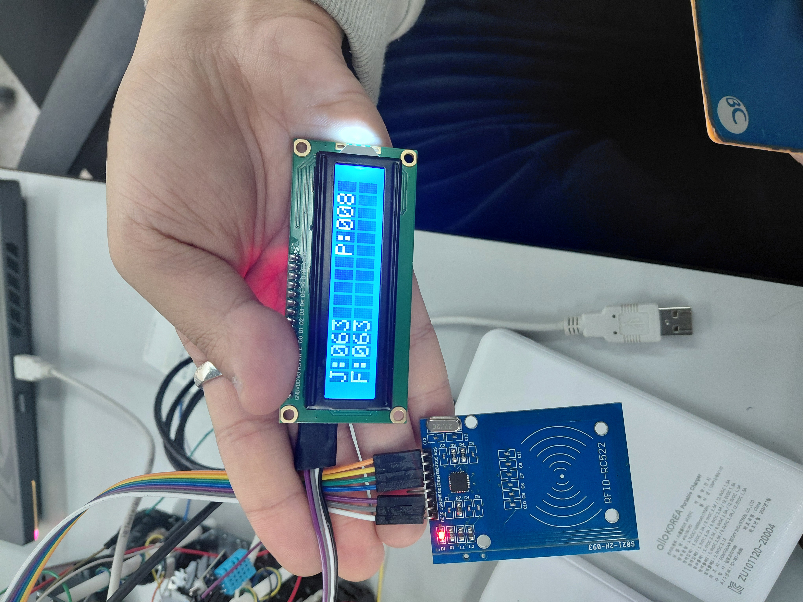
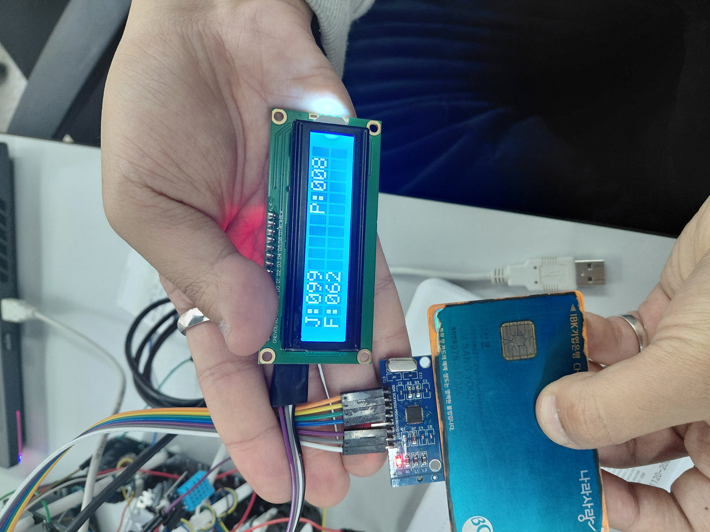

# [Final Project]Pet Robot_Final Report

**Author:** 22000167(Kim In yeop),22000561(Lee jae yong), 22201042(Lee dong jun), 22201009(Kim sang yoon) 

**Date:** December 22, 2025

**Github:**https://github.com/henny041520-commits/EC-DJLee-042,https://github.com/Kiminyeop-cpu/EC-Kiminyeop-2025,https://github.com/passtock/EC-jylee-561.git, ‣ 

**Demo Video:** [https://youtu.be/Qet1xuWcOm8](https://youtu.be/Qet1xuWcOm8)


---

## 1. Introduction

This report describes the design and implementation of the **Interaction Board** of a pet robot system. This board measures **pressure (ADC)**, manages internal status variables (**joy**, **fullness**) that decay over time, detects **RFID card interactions (MFRC522)**, and displays status on a **1602 LCD (I2C)**. Based on user interaction and internal conditions, the board sends **state/event signals via USART6** to the **Emotion/Expression Board**. And now, when the Emotion emotion calculation STM board receives a total of 4 state values for joy, satiety, and pressure sensor touch from the pet interaction part through USART6, the Emotion value is updated according to the state, and the state value is displayed on the SSD1306(OLED) (I2C) according to the Emotion value.

## 1.2. Background

In modern society, increasing numbers of single-person households, the normalization of non-face-to-face interactions, and heavy academic and work-related pressures have intensified feelings of loneliness and emotional isolation. These issues are no longer viewed as purely personal concerns but as broader social problems that can negatively affect mental well-being and quality of life.

Companion animals are widely recognized as effective in alleviating loneliness by providing emotional comfort and a sense of connection. However, many people face practical limitations in raising real pets due to housing restrictions, financial costs, lack of time, allergies, and hygiene concerns. For students and individuals living alone, taking full responsibility for a living creature can be particularly challenging.

In this context, pet robots emerge as a practical alternative. A pet robot can offer emotional interaction and companionship without the long-term responsibilities associated with real animals. By responding to user actions and exhibiting changing states and behaviors, a pet robot can function as a supportive companion in everyday life. Based on this social need, this project explores the potential of a pet robot as a means to reduce loneliness and provide emotional engagement in modern living environments.

---

## 2. System Overview

The pet robot system is organized into multiple boards with separated responsibilities. This report focuses on the **Interaction Board (C, interaction.c)**.

**[Pet robot]**

- **Vision & Command Module (Python, [movenet1.py](http://movenet1.py/)):** Captures real-time video, detects humans using a pose estimation model, and recognizes red/green color signals.Sends concise movement commands to the robot via serial communication.
- **Embedded Control Module (C, tracking.c):** Receives commands from the vision module, controls motors and LEDs, and performs line tracing using IR sensors.Implements a strict priority system for safety and behavior management.
- **Interaction Board (C, interaction.c):**
    - Reads pressure via ADC and converts it to a pressure value.
    - Decreases joy/fullness periodically using TIM2 update interrupt.
    - Detects RFID tags (feed/play) using MFRC522 over SPI1.
    - Updates LCD (joy/fullness and press count).
    - Sends **event codes (2, 3, 5)** and **hold state (0/1)** to the Emotion Board through **USART6**.
- **Emotion/Expression Board (Receiver, Emotion.c):**
    - The emotion value (0-100) is updated by synthesizing USART6 events/holds, Bluetooth (USART1) 3-bit commands, and environmental sensor (DHT11) inputs.
    - When insufficient (hold=1), the emotion is further reduced in auto-decrease mode (20-second cycles)
    - Dual OLED (facial expressions) and Bluetooth log messages are output based on the calculated emotion state.

**[Smart cage]**

- Autonomus detecting & cage open system :
    
    Using two ultrasonic sensor, detecting the approaching of pet robot.
    
    And the pet robot comes to cage, the servo motor raise the stick and open the cage door.
    
- Showing present status system :
    
    LCD panel shows the present status. 
    
    when the pet robot is in cage. the lcd shows the message “the pet is in the cage”, and red led turns on.
    
    when the pet robot is out of the cage. the lcd shows the message “the pet is out of the cage”.
    
    when the button is pressed on the cage. green led turns on. if pet robot detect green led,
    
    it Move backward along the line
    

---

## 3. Embedded Interaction Module

### 3.1.1.Vision,Tracking & Command Module (movement.py,**EC2025_Final_mcu3.c**)

**MCU Platform**

- STM32F411 (NUCLEO-F411RE assumed)

### Hardware & Libraries

- **Camera:** For real-time video capture.
- **TensorFlow Lite:** For efficient pose estimation (MoveNet Lightning model).
- **OpenCV:** For image processing and color detection.
- **PySerial:** For serial communication with the robot.
- **STM32F4 microcontroller**
- **Motor drivers (PWM control)**
- **IR sensors (for line tracing)**
- **LEDs (status indication)**
- **UART (for serial communication)**

### 3.1.2. Embedded Interaction Module (C) — **EC2025_Final_mcu2.c**

### Hardware & Libraries

**MCU Platform**

- STM32F411 (NUCLEO-F411RE assumed)

- **MFRC522 RFID** : NFC card Interation
- **Pressure Sensor** : Human Touch Interaction
- **LCD1602 (I2C backpack)** : Fullness/Joy level display

**Peripherals Used**

- ADC (pressure sensor input)
- TIM2 (periodic decay timing)
- USART6 (TX to emotion board)
- UART2 (printf/debug)
- SPI1 (MFRC522 RFID)
- I2C3 (LCD1602 via I2C expander)

**Libraries (Project / EC_HAL style)**

- `ecSTM32F4v2.h` (clock, GPIO, SysTick, UART wrapper base)
- `ecMFRC522.h / ecMFRC522.c` (MFRC522 RFID driver using SPI1 + register-level protocol)
- `ecI2C_LCD.h / ecI2C_LCD.c` (I2C3-based LCD1602 driver)

### 3.1.3. Embedded Interaction Module (C) — **EC2025_Final_mcu1.c**

### Hardware & Libraries

**MCU Platform**

- STM32F411 (NUCLEO-F411RE assumed)

**Peripherals Used**

- GPIO (For status flag processing and OLED control assistance)
- USART1 (Bluetooth: Transmits emotional status and log messages)
- USART2 (PC Debug)
- USART6 (Inter-MCU Communication)
- DHT11 (Single-wire GPIO-based)
- I2C1 (OLED Display, SSD1306 X 2)

**Libraries (Project / EC_HAL style)**

- `ecSTM32F4v2.h` (GPIO, SysTick, UART wrapper base)
- `ssd1306.h / ssd13062.c` (Plot the expression by emotion level)
- `ecDHT11.h` (Temperature and Humidity calculation logic)
- `Font5x7.c` (OLED letter Unicode, Plot based pixel logic)

---

### 3.1.4 Smart Cage System - **EC2025_Final_mcu4.c**

**MCU Platform**

- STM32F411 (NUCLEO-F411RE assumed)

### Hardware & Libraries

- **Ultrasonic sensor:** Check the whther the robot approch or not
- **RGB Led:** Display the red,green,yellow light, and show the status
- **Servo motor:** Open when the robot approching to cage
- **LCD :** Showing status by word
- **Bluetooth:** For communication with the robot.

**Libraries (Project / EC_HAL style)**

- `ecSTM32F4v2.h` (GPIO, SysTick, UART wrapper base)

### 3.2. Main Logic & Features

[Pet robot movement]

- **Priority-Based Behavior:**

1. **Red Object ('E'):** Immediate stop, highest priority.

2. **Green Object ('B'):** Force back for 10 seconds.

3. **Line Tracing:** If a black line is detected, perform line tracing for 10 seconds.

4. **Face Tracking/Search:** Follow vision commands or enter search mode if no target is found.

- **Motor Control:** Adjusts speed and direction based on received commands and sensor input.
- **Timers:** Manages durations for back and trace modes.
- **Interrupts:** Handles ADC (sensor reading) and UART (command reception) efficiently.
- **Human Detection:** Uses pose estimation to detect the nose and other keypoints. If the nose is detected with high confidence, the robot follows the person, ignoring all other signals.
- **Color Signal Detection:**
- If no human is detected, the system checks for red (stop) and green (back) signals using HSV color segmentation.
- Red triggers an emergency stop; green triggers a forced back action.
- **Command Logic:**
- 'F', 'L', 'R': Follow human (forward, left, right)
- 'E': Stop (red signal)
- 'B': Back (green signal)
- 'X': Search mode (no target found)
- **Serial Communication:**
- Commands are sent only when changed or after a timeout to avoid flooding the MCU.

[Human interaction]

- **Pressure Handling (ADC):**
    - Reads `adc_raw` and converts it into voltage and pressure.
    - Every time the loop runs (500.00 ms period), pressure is computed and `prs_cnt` increments if pressure is valid.
    - Every **10 pressure counts**, an **event code 5** is sent immediately to USART6.
- **RFID Interaction (MFRC522):**
    - Detects a new RFID card using `RC522_isNewCardPresent()`.
    - Reads UID using `RC522_readCardUID()` with up to **3 retries** (10.00 ms delay each).
    - Compares UID with `feed_uid` and `play_uid`.
    - Updates joy or fullness to 100, depending on the card type, when each value falls below 70.
    - Sends event **2 or 3** via USART6 after processing.
- **Hold State Transmission (Latch-like status):**
    - If `fullness <= 50` OR `joy <= 50`, sets `hold_state = 1`.
    - Otherwise `hold_state = 0`.
    - Sends hold state **only when it changes** (prevents flooding).
- **Timed Decay (TIM2 ISR):**
    - Uses `sec_cnt` incremented by TIM2 update interrupt.
    - Every **20 interrupts**, decrements joy and fullness by 1 (if above 0).

[Emotion/Expression]

- **Environmental Monitoring (DHT11):**
    - Temperature and humidity are measured every second using a DHT11 sensor.
    - A temperature ≥ 30 °C or humidity ≥ 70% is considered a deteriorating environment.
    - If environmental deterioration begins, emotion is immediately reduced by 1.
    If the deterioration persists, emotion is further reduced every 20 seconds.
- **Bluetooth Interaction Handling (USART1):**
    - Receives 3-bit commands (000, 001, 010, 100, 110) via Bluetooth.
    - Each command represents the pet's interaction state (default, transient, appropriate, petting), in that order.
    - If the idle state is activated, petting is ignored to maintain state priority.
- **Inter-MCU Event Reception (USART6):**
    
    Receives **event code (2, 3, 5)** from the Interaction Board.
    
    - Events are processed using an edge-triggered method and consumed immediately after processing.
    - The emotion value is adjusted depending on the event type.
    - The response to the touch event (5) depends on the current emotion level. If the emotion value is below 25, the emotion will not increase even after 10 touches.
    - Continuously receives **hold status (0/1)** from USART6.
    - When the hold status reaches 1, the device determines that the user is "hungry or bored" and enters lack mode.
    - In starvation mode, the emotion value is automatically decreased every 20 seconds.
- **Emotion State Evaluation & Expression:**
    - The emotion value (0-100) determines Bad, Normal, and Good states.
    - Below 25: Bad, 25-69: Normal, 70+: Good
    - When a change in state is detected, a Bluetooth log message is output.
    Using dual OLEDs, facial expressions corresponding to the current emotional state are displayed.

[Smart cage]

- **Robot Approching Detection:**Using ultrasonic sensor, detecting the pet robot approching.
- **Cage autonomus open system:** When the pet robot approching is detected, servo motor is operating, and raise the stick(cage open). And after 5 sec, It lower the stick(cage close) - When the button that is on the cage is pressed, the servo raise the stick for 10 second, and green led turn on.
- **Present Status Showing:** Showing present status with rgb led and lcd panel. - If the pet robot in cage, lcd panel show the message "pet robot is in cage" and red led turn on. - If the pet robot is out of the cage, lcd panel show the message "pet robot is out of the cage" neither of the led turn on. - When the button that is on the cage is pressed, servo motor open, and greeb led turn on. pet robot move backward by detecting this green led.

### 3.3.1. Main Flowchart ([movenet1.py](http://movenet1.py/))



*Figure: Flowchart of the Python vision module. The system prioritizes human detection, then color signals, and sends commands accordingly.*

### 3.3.2. Main Flowchart (**EC2025_Final_mcu3**.c)


*Figure: Flowchart of the C embedded control module. The system checks priorities in order: stop, back, trace, then normal/vision commands.*

### 3.3.3. Main Flowchart (**EC2025_Final_mcu2**.c)


### 3.3.4. Main Flowchart (**EC2025_Final_mcu1**.c)


---

### 3.3.5. Main Flowchart (**EC2025_Final_mcu4.c**)


### 3.4.1. Main Code ([movenet1.py](http://movenet1.py/))

```python

# movenet1.py - Vision & Command Module

import tensorflow as tf

import cv2

import numpy as np

import serial

import time

# Serial and model setup

COM_PORT = 'COM14'

BAUD_RATE = 9600

MODEL_PATH = 'projects/robotpet/movenet_lightning.tflite'

CAM_WIDTH, CAM_HEIGHT = 1280, 720

LEFT_MARGIN = 0.43

RIGHT_MARGIN = 0.57

CONF_THRESHOLD = 0.45

RED_AREA_THRESHOLD = 300

GREEN_AREA_THRESHOLD = 300

last_sent_command = ''

last_sent_time = 0

RESEND_INTERVAL = 0.5

# Serial connection

try:

    ser = serial.Serial(COM_PORT, BAUD_RATE, timeout=1)

    time.sleep(2)

except:

    ser = None

# Load TFLite model

interpreter = tf.lite.Interpreter(model_path=MODEL_PATH)

interpreter.allocate_tensors()

input_details = interpreter.get_input_details()

output_details = interpreter.get_output_details()

cap = cv2.VideoCapture(1)

cap.set(cv2.CAP_PROP_FRAME_WIDTH, CAM_WIDTH)

cap.set(cv2.CAP_PROP_FRAME_HEIGHT, CAM_HEIGHT)

while cap.isOpened():

    ret, frame = cap.read()

    if not ret: break

    frame = cv2.flip(frame, 1)

    h, w, _ = frame.shape

    # Crop to square if needed

    if h > w:

        margin = (h - w) // 2

        frame = frame[margin : margin + w, 0 : w]

        h, w, _ = frame.shape

    command = 'S'

    status_text = "Searching..."

    box_color = (100, 100, 100)

    hsv = cv2.cvtColor(frame, cv2.COLOR_BGR2HSV)

    # --- Step 1: Human detection (highest priority) ---

    img_small = cv2.resize(frame, (192, 192))

    input_image = np.expand_dims(img_small.astype(np.uint8), axis=0)

    interpreter.set_tensor(input_details[0]['index'], input_image)

    interpreter.invoke()

    keypoints = interpreter.get_tensor(output_details[0]['index'])[0][0]

    nose_y, nose_x, nose_conf = keypoints[0]

    final_x, final_y = 0, 0

    found_body = False

    if nose_conf > 0.35:

        final_x = nose_x

        final_y = nose_y

        found_body = True

    else:

        valid_x = []

        valid_y = []

        for i in [1,2,3,4,5,6]:

            pt_y, pt_x, conf = keypoints[i]

            if conf > CONF_THRESHOLD:

                valid_x.append(pt_x)

                valid_y.append(pt_y)

        if len(valid_x) > 0:

            final_x = sum(valid_x) / len(valid_x)

            final_y = sum(valid_y) / len(valid_y)

            found_body = True

    # --- Step 2: Command decision ---

    if found_body:

        target_x = final_x * w

        target_y = final_y * h

        cv2.circle(frame, (int(target_x), int(target_y)), 15, (0,255,255), -1)

        if target_x < (w * LEFT_MARGIN):

            command = 'L'

            status_text = "Tracking: Left <<"

        elif target_x > (w * RIGHT_MARGIN):

            command = 'R'

            status_text = "Tracking: Right >>"

        else:

            command = 'F'

            status_text = "Tracking: Forward ^"

        box_color = (255,255,0)

    else:

        # Red detection

        lower_red = np.array([20,20,200])

        upper_red = np.array([40,100,255])

        mask_red = cv2.inRange(hsv, lower_red, upper_red)

        contours_red, _ = cv2.findContours(mask_red, cv2.RETR_TREE, cv2.CHAIN_APPROX_SIMPLE)

        found_red = False

        if len(contours_red) > 0:

            c = max(contours_red, key=cv2.contourArea)

            if cv2.contourArea(c) > RED_AREA_THRESHOLD:

                found_red = True

                x, y, rw, rh = cv2.boundingRect(c)

                command = 'E'

                status_text = "⛔ RED: STOP (No Human)"

                box_color = (0,0,255)

                cv2.rectangle(frame, (x,y), (x+rw, y+rh), box_color, 2)

        # Green detection

        found_green = False

        if not found_red:

            lower_green = np.array([40,100,150])

            upper_green = np.array([60,255,255])

            mask_green = cv2.inRange(hsv, lower_green, upper_green)

            contours_green, _ = cv2.findContours(mask_green, cv2.RETR_TREE, cv2.CHAIN_APPROX_SIMPLE)

            if len(contours_green) > 0:

                c = max(contours_green, key=cv2.contourArea)

                if cv2.contourArea(c) > GREEN_AREA_THRESHOLD:

                    found_green = True

                    x, y, gw, gh = cv2.boundingRect(c)

                    command = 'B'

                    status_text = "⬇ GREEN: BACK"

                    box_color = (0,255,0)

                    cv2.rectangle(frame, (x,y), (x+gw, y+gh), box_color, 2)

        if not found_red and not found_green:

            command = 'X'

            status_text = "Searching..."

            box_color = (50,50,50)

    # --- Step 3: Serial communication ---

    current_time = time.time()

    if (command != last_sent_command) or (current_time - last_sent_time > RESEND_INTERVAL):

        if ser:

            ser.write(command.encode())

        last_sent_command = command

        last_sent_time = current_time

    # UI display (optional)

    cv2.rectangle(frame, (0,0), (600,80), box_color, -1)

    cv2.putText(frame, f"CMD: {command} | {status_text}", (20,50), cv2.FONT_HERSHEY_SIMPLEX, 0.8, (255,255,255), 2)

    cv2.line(frame, (int(w*LEFT_MARGIN),0), (int(w*LEFT_MARGIN),h), (255,255,255), 1)

    cv2.line(frame, (int(w*RIGHT_MARGIN),0), (int(w*RIGHT_MARGIN),h), (255,255,255), 1)

    cv2.imshow('Robot Vision', frame)

    if cv2.waitKey(1) == ord('q'): break

cap.release()

cv2.destroyAllWindows()

if ser: ser.write(b'S'); ser.close()

```

*Comments: The code above captures video, detects humans or color signals, and sends movement commands to the robot. It prioritizes human tracking, then red/green signals, and finally search mode if nothing is detected.*

---

### 3.4.2. Main Code (**EC2025_Final_mcu3.c**)

```c

// tracking.c - Embedded Control Module

#include "ecSTM32F4v2.h"

#include "ecPWM2.h"

#include "ecADC2.h"

#define L_PWM_PIN  PA_0

#define L_DIR_PIN  PA_4

#define R_PWM_PIN  PA_1

#define R_DIR_PIN  PC_1

PinName_t seqCHn[2] = {PB_0, PB_1};

#define STOP_LED   PA_5

volatile uint32_t value1 = 0, value2 = 0;

volatile uint8_t adc_ready = 0;

int flag = 0;

volatile char python_cmd = 'S';

int trace_timer = 0, back_timer = 0, search_timer = 0;

// Motor control function

void motor_control(float speed_L, float speed_R) {

    if (speed_L >= 0) {

        GPIO_write(L_DIR_PIN, 1);

        PWM_duty(L_PWM_PIN, 1.0f - speed_L);

    } else {

        GPIO_write(L_DIR_PIN, 0);

        PWM_duty(L_PWM_PIN, -speed_L);

    }

    if (speed_R >= 0) {

        GPIO_write(R_DIR_PIN, 1);

        PWM_duty(R_PWM_PIN, 1.0f - speed_R);

    } else {

        GPIO_write(R_DIR_PIN, 0);

        PWM_duty(R_PWM_PIN, -speed_R);

    }

}

void setup(void) {

    RCC_PLL_init(); SysTick_init();

    PWM_init(L_PWM_PIN); PWM_init(R_PWM_PIN);

    PWM_period_us(L_PWM_PIN, 1000); PWM_period_us(R_PWM_PIN, 1000);

    GPIO_init(L_DIR_PIN, OUTPUT); GPIO_init(R_DIR_PIN, OUTPUT);

    motor_control(0, 0);

    GPIO_init(STOP_LED, OUTPUT);

    UART2_init(); UART2_baud(BAUD_9600);

    UART1_init(); UART1_baud(BAUD_9600);

    ADC_init(PB_0); ADC_init(PB_1);

    ADC_sequence(seqCHn, 2);

    ADC->CCR = (ADC->CCR & ~(3UL << 16)) | (3UL << 16);

    GPIO_init(PB_0, ANALOG); GPIO_pupd(PB_0, EC_NONE);

    GPIO_init(PB_1, ANALOG); GPIO_pupd(PB_1, EC_NONE);

    NVIC_EnableIRQ(ADC_IRQn); NVIC_SetPriority(ADC_IRQn, 2);

    NVIC_EnableIRQ(USART1_IRQn); NVIC_SetPriority(USART1_IRQn, 3);

    ADC_start();

}

void ADC_IRQHandler(void){

    if(is_ADC_OVR()) clear_ADC_OVR();

    if(is_ADC_EOC()){

        if (flag==0) { value1 = ADC_read(); }

        else if (flag==1) { value2 = ADC_read(); adc_ready = 1; }

        flag = !flag;

    }

}

void USART1_IRQHandler(void){

    if(is_USART1_RXNE()){

        char received = (char)USART1_read();

        if (received == 'B') {

            back_timer = 10000;   // 10s back

            python_cmd = 'S';

        }

        if (back_timer == 0) {

            python_cmd = received;

        }

    }

}

int main(void) {

    setup();

    while(1){

        if(adc_ready){

            adc_ready = 0;

            uint32_t v1 = value1, v2 = value2;

            int is_Black_R = (v1 >= 3000U);

            int is_Black_L = (v2 >= 3000U);

            // 1. Red: Stop

            if (python_cmd == 'E') {

                motor_control(0.0f, 0.0f);

                GPIO_write(STOP_LED, 1);

                back_timer = 0; trace_timer = 0; search_timer = 0;

            }

            // 2. Green: Back

            else if (back_timer > 0) {

                back_timer--;

                motor_control(-0.60f, -0.60f);

                GPIO_write(STOP_LED, 1);

            }

            // 3. Line tracing

            else if (trace_timer > 0) {

                trace_timer--;

                GPIO_write(STOP_LED, 1);

                if (!is_Black_L && !is_Black_R) motor_control(0.60f, 0.60f);

                else if (is_Black_L && !is_Black_R) motor_control(-0.60f, 0.60f);

                else if (!is_Black_L && is_Black_R) motor_control(0.60f, -0.60f);

                else motor_control(0.0f, 0.0f);

            }

            // 4. Normal mode

            else {

                GPIO_write(STOP_LED, 0);

                if (is_Black_L || is_Black_R) {

                    trace_timer = 10000;

                } else {

                    if (python_cmd == 'X') {

                        if (search_timer <= 0) search_timer = 6000;

                        search_timer--;

                        if (search_timer > 1000) {

                            motor_control(0.0f, 0.0f);

                        } else {

                            motor_control(-0.70f, 0.70f);

                        }

                    } else {

                        search_timer = 0;

                        switch(python_cmd) {

                            case 'F': motor_control(1.0f, 1.0f); break;

                            case 'L': motor_control(0.60f, -0.60f); break;

                            case 'R': motor_control(-0.60f, 0.60f); break;

                            case 'S': default: motor_control(0.0f, 0.0f); break;

                        }

                    }

                }

            }

        }

    }

}

```

*Comments: The code above receives commands from the vision module, prioritizes safety (stop/back), and controls the motors and LEDs accordingly. It also supports line tracing and search mode.*

---

### 3.4.3. Main Code (**EC2025_Final_mcu2.c**)

```c
#include "ecSTM32F4v2.h"
#include "ecMFRC522.h"
#include "ecI2C_LCD.h"

/* =========================
 * Global variables
 * =========================
 * adc_raw   : Raw ADC conversion result (0..4095)
 * pressure  : Converted pressure value from ADC voltage
 * joy/fullness : Emotional state values that decay with time and refill via RFID
 * prs_cnt   : Pressure event counter (used to trigger event every 10 counts)
 * sec_cnt   : Timer-based counter for periodic decay
 * state     : Temporary event state for RFID events (2/3). (Event 5 is sent immediately.)
 */
volatile uint32_t adc_raw = 0;
volatile float pressure = 0;
volatile int joy = 70;
volatile int fullness = 70;
volatile int prs_cnt = 0;
volatile uint32_t sec_cnt = 0;
volatile int feed_uid_cnt = 0;
volatile int play_uid_cnt = 0;
volatile int state = 0;

/* =========================
 * Hold state (latched status)
 * =========================
 * hold_state      : 1 if (joy <= 50) OR (fullness <= 50), else 0
 * prev_hold_state : used to transmit only on changes
 */
volatile int hold_state = 0;
volatile int prev_hold_state = 0;

/* =========================
 * RC522 recovery counter
 * =========================
 * If card detection fails continuously for long time, re-init RC522.
 */
volatile uint32_t rc522_fail_cnt = 0;

/* =========================
 * Authorized UID arrays (4-byte UID)
 * feed_uid : RFID tag for "feeding"
 * play_uid : RFID tag for "playing"
 */
uint8_t feed_uid[4] = {0x22, 0x36, 0x87, 0x90};
uint8_t play_uid[4] = {0xE1, 0x11, 0x15, 0x0E};

/* =========================
 * USART6 event TX helper
 * =========================
 * Sends a single-byte event code to the Emotion Board via USART6.
 * Code meaning (example mapping):
 *  - 2 : interaction detected but no refill needed
 *  - 3 : refill event occurred (joy/fullness restored)
 *  - 5 : pressure event threshold reached (every 10 counts)
 */
static void send_event_usart6(uint8_t code){
    USART_write(USART6, &code, 1);
}

/* =========================
 * Hold-state TX helper (change-only)
 * =========================
 * Sends hold_state=1 or 0 only when it changes.
 * Receiver can latch "low status mode" when it receives 1,
 * and clear that mode when it receives 0.
 */
static void update_hold_usart6(void){
    if(hold_state != prev_hold_state){
        uint8_t tx = (uint8_t)hold_state;
        USART_write(USART6, &tx, 1);
        prev_hold_state = hold_state;
    }
}

/* =========================
 * RC522 auto-recovery
 * =========================
 * If RC522 detects no card for a long time continuously,
 * re-initialize RC522 to recover from stuck SPI/RF states.
 * present=1 -> reset fail counter
 * present=0 -> increment fail counter; if threshold reached -> RC522_init()
 */
static void RC522_recover_if_stuck(uint8_t present){
    if(present) rc522_fail_cnt = 0;
    else{
        rc522_fail_cnt++;
        if(rc522_fail_cnt >= 40){                 // 0.50 s * 40 = 20.00 s
            RC522_init();                         // re-init SPI + RC522 registers
            rc522_fail_cnt = 0;
        }
    }
}

void setup(void){
    /* System clock + SysTick time base */
    RCC_PLL_init();
    SysTick_init();

    /* TIM2 update interrupt setup:
     * TIM_UI_init(TIM2, 1000) -> project-specific meaning (tick base)
     * Used in TIM2_IRQHandler to create periodic joy/fullness decay.
     */
    TIM_UI_init(TIM2, 1000);
    TIM_UI_enable(TIM2);

    /* Pressure sensor ADC input on PA_0 */
    ADC_init(PA_0);

    /* UART2: printf/debug output */
    UART2_init();
    UART2_baud(9600);

    /* USART6: TX-only link to Emotion Board */
    UART6_init();
    UART6_baud(9600);

    /* USART6 RX interrupt disabled because this board only transmits to receiver */
    USART6->CR1 &= ~USART_CR1_RXNEIE;
    NVIC_DisableIRQ(USART6_IRQn);

    /* MFRC522 RFID init (SPI1 + reset + antenna on) */
    RC522_init();

    /* LCD1602 over I2C3: SCL=PA_8, SDA=PC_9 */
    I2C3_init_LCD(PA_8, PC_9);
    LCD1602_init();
    LCD1602_clear();
    LCD1602_setCursor(0, 0);
    LCD1602_print("J:");
    LCD1602_setCursor(1, 0);
    LCD1602_print("F:");

    /* RFID version register read for debugging */
    uint8_t ver = RC522_readVersion();
    printf("RC522 VersionReg = 0x%02X\\r\\n", ver);

    if(ver == 0x91 || ver == 0x92) printf("MFRC522 SPI OK\\r\\n");
    else                           printf("MFRC522 SPI FAIL\\r\\n");
}

int main(void){
    setup();

    uint8_t uid[10];
    uint8_t uidSize;

    state = 0;

    while(1){
        /* =========================
         * Pressure conversion
         * =========================
         * voltage = adc_raw * 3.30 / 4095.00
         * pressure mapping example:
         * pressure = (voltage - 0.50) * (100.00 / 4.00)
         */
        float voltage = adc_raw * 3.30f / 4095.00f;
        pressure = (voltage - 0.50f) * (100.00f / 4.00f);

        /* =========================
         * Event (pressure) -> send code 5 every 10 counts
         * ========================= */
        if(pressure >= 0.00f){
            prs_cnt++;
            printf("Pressure: %d\\r\\n", prs_cnt);
            printf("pressure = %d.%02d\\r\\n",
                   (int)pressure,
                   (int)((pressure - (int)pressure) * 100.00f));

            if(prs_cnt >= 10){
                prs_cnt = 0;
                send_event_usart6(5);   // immediate send to avoid being overwritten by RFID states
            }
        }

        /* =========================
         * LCD update (joy, fullness)
         * ========================= */
        LCD1602_setCursor(0, 2);
        LCD1602_printInt3(joy);
        LCD1602_print("   ");

        LCD1602_setCursor(1, 2);
        LCD1602_printInt3(fullness);
        LCD1602_print("   ");

        /* Display pressure counter on LCD (example "P:010") */
        LCD1602_setCursor(0, 10);
        LCD1602_print("P:");
        LCD1602_printInt3(prs_cnt);

        /* =========================
         * RFID: check card presence + recovery
         * ========================= */
        uint8_t present = RC522_isNewCardPresent();
        RC522_recover_if_stuck(present);

        if (present){

            /* Reset counters for this tagging attempt */
            feed_uid_cnt = 0;
            play_uid_cnt = 0;
            uidSize = 0;

            /* UID read may fail due to RF distance/angle -> retry up to 3 times */
            int ok = 0;
            for(int retry = 0; retry < 3; retry++){
                if (RC522_readCardUID(uid, &uidSize) == MI_OK){
                    ok = 1;
                    break;
                }
                delay_ms(10);  // 10.00 ms wait before next attempt
            }

            if (ok){

                printf("Card UID: ");
                for (int i = 0; i < uidSize; i++){
                    printf("%02X ", uid[i]);

                    /* Match counters for feed/play UID */
                    if(uid[i] == feed_uid[i]) feed_uid_cnt++;
                    if(uid[i] == play_uid[i]) play_uid_cnt++;
                }
                printf("\\r\\n");

                /* Decide RFID action:
                 * - if play tag -> joy refill logic
                 * - if feed tag -> fullness refill logic
                 * Event code mapping:
                 *  - state=2: interaction but already high enough (>=70)
                 *  - state=3: refill (set to 100)
                 */
                if(play_uid_cnt == uidSize){
                    if(joy >= 70) state = 2;
                    else{
                        joy = 100;
                        state = 3;
                    }
                    printf("play\\r\\n");
                }
                else if(feed_uid_cnt == uidSize){
                    if(fullness >= 70) state = 2;
                    else{
                        fullness = 100;
                        state = 3;
                    }
                    printf("feed\\r\\n");
                }
                else{
                    /* Unknown tag -> clear attempt variables */
                    feed_uid_cnt = 0;
                    play_uid_cnt = 0;
                    uidSize = 0;
                }

                /* Debounce / reduce repeated detection of same tag */
                delay_ms(200);
            }
            else{
                /* UID read failed -> clear attempt variables */
                feed_uid_cnt = 0;
                play_uid_cnt = 0;
                uidSize = 0;
            }
        }

        /* =========================
         * Hold state computation
         * ========================= */
        if(fullness <= 50 || joy <= 50){
            hold_state = 1;   // request receiver to hold "low-status expression mode"
        }
        else{
            hold_state = 0;   // release that mode
        }

        /* Transmit hold_state only when it changes */
        update_hold_usart6();

        /* =========================
         * Transmit RFID event codes (2/3)
         * =========================
         * Pressure event (5) is transmitted immediately above.
         */
        if(state == 2 || state == 3){
            send_event_usart6((uint8_t)state);
            state = 0;        // clear after sending
        }

        /* Main loop period: 500.00 ms */
        delay_ms(500);
    }
}

/* =========================
 * ADC interrupt handler
 * =========================
 * Updates adc_raw whenever End-Of-Conversion occurs.
 */
void ADC_IRQHandler(void){
    if(is_ADC_EOC()){
        adc_raw = ADC_read();
    }
    clear_ADC_OVR();
}

/* =========================
 * TIM2 interrupt handler
 * =========================
 * Periodically decreases joy/fullness.
 * sec_cnt increments each UIF. Every 20 counts:
 *  - fullness-- if >0
 *  - joy-- if >0
 */
void TIM2_IRQHandler(void){
    if(is_UIF(TIM2)){
        sec_cnt++;

        if(sec_cnt >= 20){
            sec_cnt = 0;

            if(fullness > 0){
                fullness -= 1;
                printf("fullness : %d\\r\\n", fullness);
            }
            if(joy > 0){
                joy -= 1;
                printf("joy : %d\\r\\n", joy);
            }
        }
        clear_UIF(TIM2);
    }
}

```

### 3.4.4. Main Code (**EC2025_Final_mcu1.c**)

```c
#include "ecSTM32F4v2.h"
#include "ecGPIO2.h"
#include "ecUART2.h"
#include "ecSysTick2.h"
#include "ecDHT11.h"
#include "ssd1306.h"     // OLED1
#include "ssd13062.h"    // OLED2
#include <string.h>
#include <stdio.h>
#include <stdarg.h>

// =======================================================
// ✅ 3-bit state input pins between MCUs (GPIO READ)
// =======================================================
// =======================================================
// ✅ UART6 Reception State Variables (Replaces GPIO)
// =======================================================
volatile uint8_t uart6_event = 4;   // default state
volatile uint8_t uart6_hold  = 0;   // HOLD state (0/1)

#ifndef LOW
#define LOW  0
#endif
#ifndef HIGH
#define HIGH 1
#endif

DHT11_t dht;

// =======================================================
// OLED Objects
// =======================================================
SSD1306_t oled1;       // Original OLED -> Left side
SSD1306_2_t oled2;     // New OLED -> Right side

// =======================================================
// EMOTION SYSTEM VARIABLES
// =======================================================
int emotion = 50;

volatile char bt_buf[3] = {0,0,0};
volatile uint8_t bt_idx = 0;
volatile uint8_t BT_code = 0;

volatile char pc_buf[2] = {0,0};
volatile uint8_t PC_code = 0;

extern volatile uint32_t msTicks;

int emo_state = 1;   // 0=Bad, 1=Normal, 2=Good

// ---------------------- DHT11 Variables --------------------
float temp = 0.0f;
float humi = 0.0f;

uint8_t env_bad = 0;
uint32_t env_bad_start_time = 0;
uint32_t last_env_print_time = 0;

// =======================================================
// ★ Automatic reduction variables for '00' Mode
// =======================================================
uint8_t mode_00_active = 0;
uint32_t mode_00_timer = 0;

// =======================================================
// OLED Alternating Display Control Variables
// =======================================================
uint8_t oled_toggle = 0;
uint32_t last_oled_swap = 0;

// =======================================================
// ✅ For GPIO State Detection
// =======================================================
uint8_t last_gpio_state = 4;   // default=001 -> treated as state 4

// =======================================================
// Function to limit Emotion value range
// =======================================================
void clamp_emotion(){
    if(emotion < 0) emotion = 0;
    if(emotion > 100) emotion = 100;
}

// =======================================================
// Bluetooth Transmission
// =======================================================
void BT_print(char *msg){
    USART1_write((uint8_t *)msg, strlen(msg));
}

void BT_printf(const char *fmt, ...)
{
    char buf[128];
    va_list args;
    va_start(args, fmt);
    vsnprintf(buf, sizeof(buf), fmt, args);
    va_end(args);
    BT_print(buf);
}

// =======================================================
// USART1 RX INTERRUPT (Bluetooth)
// =======================================================
void USART1_IRQHandler(void){
    if(is_USART1_RXNE()){
        char c = USART1_read();

        if(c == '0' || c == '1'){
            bt_buf[bt_idx++] = c;

            if(bt_idx == 3){
                // === Only 5 specific states allowed ===
                if     (bt_buf[0]=='0' && bt_buf[1]=='0' && bt_buf[2]=='1') BT_code = 1; // 001 default
                else if(bt_buf[0]=='1' && bt_buf[1]=='0' && bt_buf[2]=='0') BT_code = 2; // 100 excessive
                else if(bt_buf[0]=='0' && bt_buf[1]=='1' && bt_buf[2]=='0') BT_code = 3; // 010 appropriate
                else if(bt_buf[0]=='0' && bt_buf[1]=='0' && bt_buf[2]=='0') BT_code = 4; // 000 lacking
                else if(bt_buf[0]=='1' && bt_buf[1]=='1' && bt_buf[2]=='0') BT_code = 5; // 110 petting
                else BT_code = 0;  // ❌ Input not allowed

                bt_idx = 0;
            }
        }
    }
}

// =======================================================
// USART2 RX INTERRUPT (PC Keyboard)
// =======================================================
void USART2_IRQHandler(void){
    if(is_USART2_RXNE()){
        char c = USART2_read();

        if(c=='0' || c=='1'){
            pc_buf[0] = pc_buf[1];
            pc_buf[1] = c;

            if(pc_buf[0] != 0 && pc_buf[1] != 0){
                if(pc_buf[0]=='0' && pc_buf[1]=='1') PC_code = 2;
                else if(pc_buf[0]=='1' && pc_buf[1]=='0') PC_code = 3;
                else if(pc_buf[0]=='1' && pc_buf[1]=='1') PC_code = 4;
                else if(pc_buf[0]=='0' && pc_buf[1]=='0') PC_code = 1;

                pc_buf[0] = pc_buf[1] = 0;
            }
        }
    }
}

void USART6_IRQHandler(void){
    if(is_USART_RXNE(USART6)){
        uint8_t rx = USART_read(USART6);

        if(rx == 0 || rx == 1){
            uart6_hold = rx;          // flag
        }
        else if(rx >= 2 && rx <= 5){
            uart6_event = rx;         // state 2/3/4
        }
    }
}

uint8_t get_event_from_uart6(void)
{
    return uart6_event;   // returns 2,3,4 or 4 (default)
}

uint8_t is_lack_from_uart6(void)
{
    return (uart6_hold == 1);
}

// =======================================================
// ✅ "Read" 3-bit GPIO state and convert to state number
// state=0:000, 1:100, 2:010, 3:110, 4:001(default)
// Other combinations are treated as 4 (default)
// =======================================================
uint8_t read_state_gpio(void)
{
    return uart6_event;
}

// =======================================================
// SETUP
// =======================================================
void setup(void){
    RCC_PLL_init();
    SysTick_init();

    UART2_init();
    UART2_baud(9600);
    UART1_init();
    UART1_baud(9600);

    USART1->CR1 |= USART_CR1_RXNEIE;
    USART2->CR1 |= USART_CR1_RXNEIE;

    NVIC_EnableIRQ(USART1_IRQn);
    NVIC_EnableIRQ(USART2_IRQn);

    // =====================================================
    // ✅ Initialize 3-bit GPIO "Input" pins (READ)
    // =====================================================
    UART6_init();
    UART6_baud(9600);

    USART6->CR1 |= USART_CR1_RXNEIE;
    NVIC_EnableIRQ(USART6_IRQn);

    // Initialize last_gpio_state by reading GPIO state immediately after boot
    last_gpio_state = read_state_gpio();
    DHT11_init(&dht, PB_5);

    printf("=== Emotion + DHT11 READY ===\\r\\n");
    BT_print("=== Emotion Score is Initialized by 50 ===\\r\\n");

    // =====================================================
    // Initialize two OLEDs
    // =====================================================
    ssd1306_init(&oled1);
    ssd1306_2_init(&oled2);
    ssd1306_clear(&oled1);
    ssd1306_2_clear(&oled2);
    ssd1306_update(&oled1);
    ssd1306_2_update(&oled2);
}

// =======================================================
// MAIN LOOP
// =======================================================
int main(void){
    setup();

    while(1){

        // ======================================================
        // (A) Output Temp/Humi once per second
        // ======================================================
        if(msTicks - last_env_print_time >= 1000){
            last_env_print_time = msTicks;

            int ret = DHT11_read(&dht, &temp, &humi);
            if(ret == 0){
                int temp_int = (int)temp;
                int temp_dec = (int)((temp - temp_int) * 100);
                int humi_int = (int)humi;
                int humi_dec = (int)((humi - humi_int) * 100);
                BT_printf("Temp=%d.%02dC, Humi=%d.%02d%%\\r\\n",
                       temp_int, temp_dec, humi_int, humi_dec);
            } else {
                BT_printf("DHT11 Error (%d)\\r\\n", ret);
            }

            uint8_t now_bad = (temp >= 30.0f || humi >= 70.0f);

            if(now_bad && env_bad == 0){
                env_bad = 1;
                env_bad_start_time = msTicks;
                emotion -= 1; clamp_emotion();
                BT_printf("Environment is worsen! Emotion=%d\\r\\n", emotion);
            }
            else if(now_bad && env_bad == 1){
                if(msTicks - env_bad_start_time >= 20000){
                    env_bad_start_time = msTicks;
                    emotion -= 1; clamp_emotion();
                    BT_printf("1 minute passed after environmental deterioration persists -> Emotion=%d\\r\\n", emotion);
                }
            }
            else if(!now_bad && env_bad == 1){
                env_bad = 0;
                BT_printf("Environment normalized. Deterioration timer reset.\\r\\n");
            }
        }

        // ======================================================
        // (B) Bluetooth Command Processing
        // ======================================================
        if(BT_code != 0){
            if(mode_00_active && BT_code == 5){
                BT_printf("[BT] 110 Ignored (Maintaining 000 mode)\\r\\n");
                BT_code = 0;
                continue;
            }
            if(BT_code != 4) mode_00_active = 0;

            // ✅ BT 3bit (5 states) -> Action
            int bt_state = 4;

            switch(BT_code){
                case 1:   // 001 default
                    bt_state = 4;
                    BT_print("[BT]001\\r\\n");
                    break;

                case 2:   // 100 excessive
                    bt_state = 1;
                    emotion -= 1; clamp_emotion(); BT_print("[BT]100\\r\\n");
                    break;

                case 3:   // 010 appropriate
                    bt_state = 2;
                    emotion += 5; clamp_emotion(); BT_print("[BT]010\\r\\n");
                    break;

                case 4:   // 000 lacking
                    bt_state = 0;
                    emotion -= 1; clamp_emotion(); BT_print("[BT]000\\r\\n");
                    mode_00_active = 1; mode_00_timer = msTicks;
                    break;

                case 5:   // 110 petting
                    bt_state = 3;
                    emotion += 1; clamp_emotion(); BT_print("[BT]110\\r\\n");
                    break;
            }

            BT_code = 0;
            BT_printf("Emotion = %d\\r\\n", emotion);
        }

        // ======================================================
        // ✅ (B-2) GPIO Input Processing — EDGE TRIGGER
        // ======================================================
        {
        uint8_t event = get_event_from_uart6();

        // ================================
        // 1️⃣ EVENT is always edge-triggered
        // ================================
        if(last_gpio_state == 4 && event != 4){

            BT_printf("[UART EVENT] %d\\r\\n", event);

            switch(event){
                case 2: // OVER
                    emotion -= 1;
                    clamp_emotion();
                    BT_printf("[EVENT 2: OVER: Joy or fullness is excessive. Rest is required.] Emotion=%d\\r\\n", emotion);
                    break;

                case 3: // CARD REFILL
                    emotion += 5;
                    clamp_emotion();
                    BT_printf("[EVENT 3: GOOD: If you continue to care about joy and fullness, your pet will stay happy.] Emotion=%d\\r\\n", emotion);
                    break;

                case 5: // PRESSURE / TOUCH
                    if(emotion < 25){
                        BT_printf("[EVENT 5: TOUCH IGNORED: A pet that has already lost interest cannot be soothed by touch alone. Please feed or play with it.] Emotion=%d\\r\\n", emotion);
                    }
                    else{
                        emotion += 1;
                        clamp_emotion();
                        BT_printf("[EVENT 5: TOUCH OK: When the pet is in a happy state, petting makes it even happier.] Emotion=%d\\r\\n", emotion);
                    }
                    break;
            }

            clamp_emotion();
            uart6_event = 4;   // Consume event
        }

        // Update last_state for EVENT detection
        last_gpio_state = event;

        }

        // ======================================================
        // (C) PC Command Processing
        // ======================================================
        if(PC_code != 0){
            switch(PC_code){
                case 1: emotion -= 1; break;
                case 2: emotion -= 1; break;
                case 3: emotion += 5; break;
                case 5: emotion += 1; break;
            }
            clamp_emotion();
            BT_printf("Emotion = %d\\r\\n", emotion);
            PC_code = 0;
        }

        // ======================================================
        // (LACK) UART6 HOLD -> Entry control for '00' Mode
        // ======================================================
        if(is_lack_from_uart6()){

            // Moment of entering 'lacking' state for the first time
            if(!mode_00_active){
                mode_00_active = 1;
                mode_00_timer = msTicks;

                emotion -= 1;
                clamp_emotion();

                BT_printf("[UART LACK ENTER: The pet is hungry or bored. Please feed it or play with it.] Emotion=%d\\r\\n", emotion);
            }
        }
        else{
            // Lack state released
            mode_00_active = 0;
        }

        // ======================================================
        // (F) Automatic reduction in '00' Mode
        // ======================================================
        if(mode_00_active){
            if(msTicks - mode_00_timer >= 20000){
                mode_00_timer = msTicks;
                emotion -= 1;
                clamp_emotion();
                BT_printf("The pet is hungry and bored. Please pay attention to it, master... -> Emotion=%d\\r\\n", emotion);
            }
        }

        // ======================================================
        // (E) State Transition Detection + OLED Output
        // ======================================================
        int new_state;
        if(emotion < 25) new_state = 0;
        else if(emotion < 70) new_state = 1;
        else new_state = 2;

        if(new_state != emo_state){
            emo_state = new_state;
            if(emo_state == 0){ BT_printf("Angry and Sad\\r\\n"); BT_print("Bad\\r\\n"); }
            if(emo_state == 1){ BT_printf("Normal\\r\\n"); BT_print("Normal\\r\\n"); }
            if(emo_state == 2){ BT_printf("Very Happy\\r\\n"); BT_print("Good\\r\\n"); }
        }

        // ======================================================
        // (G) Rapid alternating display on two OLEDs (Persistence of vision)
        // ======================================================
        if(msTicks - last_oled_swap >= 2){ // Approx 500Hz alternation
            last_oled_swap = msTicks;
            oled_toggle = !oled_toggle;

            if(oled_toggle == 0){
                ssd1306_clear(&oled1);
                if(emo_state == 0) ssd1306_eye_sad(&oled1);
                else if(emo_state == 1) ssd1306_eye_normal(&oled1);
                else ssd1306_eye_happy(&oled1);
                ssd1306_update(&oled1);
            } else {
                ssd1306_2_clear(&oled2);
                if(emo_state == 0) ssd1306_2_eye_sad(&oled2);
                else if(emo_state == 1) ssd1306_2_eye_normal(&oled2);
                else ssd1306_2_eye_happy(&oled2);
                ssd1306_2_update(&oled2);
            }
        }
        delay_ms(10);
    }
}

```

---

### 3.4.5. Main Code (**EC2025_Final_mcu4.c**)

```c

#include "ecSTM32F4v2.h"
#include "math.h"

volatile uint32_t ovf_cnt = 0;
volatile uint32_t ovf_cnt2 = 0;
volatile float timeInterval = 0;
volatile float timeInterval2 = 0;

float distance = 0;
float distance2 = 0;

float time1 = 0, time2 = 0;
float time3 = 0, time4 = 0;

int GoOrStopMode = 0;
int prev_GoOrStopMode = -1;
volatile int Exti_delay_flag = 0;

int door_flag = 0;

#define PWM_PIN    PA_8
#define TRIG       PA_6
#define ECHO       PB_6
#define TRIG2      PB_5
#define ECHO2      PC_8
#define BUTTON_PIN PC_13

#define LCD_RS   PB_8
#define LCD_E    PB_9
#define LCD_D4   PB_10
#define LCD_D5   PB_4
#define LCD_D6   PB_2
#define LCD_D7   PB_3

#define LED_R   PA_0
#define LED_G   PA_1
#define LED_Y   PA_2

float angle(int angle){
    return 0.5f + (2.0f * angle / 180.0f);
}

static void lcd_pulse_enable(void){
    GPIO_write(LCD_E, HIGH);
    delay_ms(1);
    GPIO_write(LCD_E, LOW);
    delay_ms(1);
}

static void lcd_write4(uint8_t nibble){
    GPIO_write(LCD_D4, (nibble >> 0) & 1);
    GPIO_write(LCD_D5, (nibble >> 1) & 1);
    GPIO_write(LCD_D6, (nibble >> 2) & 1);
    GPIO_write(LCD_D7, (nibble >> 3) & 1);
    lcd_pulse_enable();
}

static void lcd_send(uint8_t data, uint8_t rs){
    GPIO_write(LCD_RS, rs);
    lcd_write4(data >> 4);
    lcd_write4(data & 0x0F);
}

static void lcd_cmd(uint8_t cmd){
    lcd_send(cmd, 0);
    delay_ms(2);
}

static void lcd_data(uint8_t ch){
    lcd_send(ch, 1);
}

static void lcd_init_4bit(void){
    GPIO_init(LCD_RS, OUTPUT);
    GPIO_init(LCD_E,  OUTPUT);
    GPIO_init(LCD_D4, OUTPUT);
    GPIO_init(LCD_D5, OUTPUT);
    GPIO_init(LCD_D6, OUTPUT);
    GPIO_init(LCD_D7, OUTPUT);

    GPIO_write(LCD_RS, LOW);
    GPIO_write(LCD_E,  LOW);

    delay_ms(40);

    lcd_write4(0x03); delay_ms(5);
    lcd_write4(0x03); delay_ms(5);
    lcd_write4(0x03); delay_ms(5);
    lcd_write4(0x02); delay_ms(5);

    lcd_cmd(0x28);
    lcd_cmd(0x08);
    lcd_cmd(0x01);
    lcd_cmd(0x06);
    lcd_cmd(0x0C);
}

static void lcd_set_cursor(uint8_t row, uint8_t col){
    uint8_t addr = (row == 0) ? 0x00 : 0x40;
    lcd_cmd(0x80 | (addr + col));
}

static void lcd_print(const char *s){
    while(*s) lcd_data((uint8_t)(*s++));
}

void setup(void){
    RCC_PLL_init();
    SysTick_init();

    UART1_init();
    UART1_baud(BAUD_9600);

    GPIO_init(BUTTON_PIN, INPUT);
    GPIO_pupd(BUTTON_PIN, 0);
    EXTI_init(BUTTON_PIN, FALL, 0);

    PWM_init(TRIG);
    PWM_period_us(TRIG, 50000);
    PWM_pulsewidth_us(TRIG, 10);

    ICAP_init(ECHO);
    ICAP_counter_us(ECHO, 10);
    ICAP_setup(ECHO, 1, IC_RISE);
    ICAP_setup(ECHO, 2, IC_FALL);

    PWM_init(TRIG2);
    PWM_period_us(TRIG2, 50000);
    PWM_pulsewidth_us(TRIG2, 10);

    ICAP_init(ECHO2);
    ICAP_counter_us(ECHO2, 10);
    ICAP_setup(ECHO2, 3, IC_RISE);
    ICAP_setup(ECHO2, 4, IC_FALL);

    GPIO_init(PWM_PIN, AF);
    PWM_init(PWM_PIN);
    PWM_period_ms(PWM_PIN, 20);

    lcd_init_4bit();
    lcd_set_cursor(0,0);
    lcd_print("System Ready");

    GPIO_init(LED_R, OUTPUT);
    GPIO_init(LED_G, OUTPUT);
    GPIO_init(LED_Y, OUTPUT);

    GPIO_write(LED_R, LOW);
    GPIO_write(LED_G, LOW);
    GPIO_write(LED_Y, LOW);
}

int main(void){
    setup();

    char buf[64];
    char buf2[64];
    int n, n2;

    while(1){

        distance  = timeInterval  * 340.0f / 2.0f / 10.0f;
        distance2 = timeInterval2 * 340.0f / 2.0f / 10.0f;

        if(distance2 <= 20.0f){
            GoOrStopMode = 1;
            door_flag = 0;
        }
        else if(distance <= 10){
            door_flag = 1;
        }else if((distance > 10 && distance2 > 17)){
            door_flag = 0;
            GoOrStopMode = 0;
        }

        if(Exti_delay_flag == 1){
            GPIO_write(LED_R,LOW);
            PWM_pulsewidth_ms(PWM_PIN, angle(10));
            GPIO_write(LED_G,HIGH);
            delay_ms(10000);
            PWM_pulsewidth_ms(PWM_PIN,angle(90));
            GPIO_write(LED_R,LOW);
            GPIO_write(LED_G,LOW);

            Exti_delay_flag = 0;
        }

        if(door_flag == 0){
            PWM_pulsewidth_ms(PWM_PIN, angle(90));
        }else{
            PWM_pulsewidth_ms(PWM_PIN, angle(10));
            delay_ms(3000);
        }

        if(GoOrStopMode != prev_GoOrStopMode){
            lcd_cmd(0x01);
            lcd_set_cursor(0,0);

            if(GoOrStopMode == 1){
                lcd_print("Pet is in Cage");
                GPIO_write(LED_G,LOW);
                GPIO_write(LED_R,HIGH);
            }else{
                lcd_print("Pet is out");
                GPIO_write(LED_R,LOW);
                GPIO_write(LED_G,LOW);
            }

            prev_GoOrStopMode = GoOrStopMode;
        }

        n = snprintf(buf, sizeof(buf), "S1: %.2f cm\\r\\n", distance);
        USART1_write((uint8_t*)buf, n);

        n2 = snprintf(buf2, sizeof(buf2), "S2: %.2f cm\\r\\n", distance2);
        USART1_write((uint8_t*)buf2, n2);

        delay_ms(500);
    }
}

void TIM4_IRQHandler(void){
    if(is_UIF(TIM4)){
        ovf_cnt++;
        clear_UIF(TIM4);
    }
    if(is_CCIF(TIM4, 1)){
        time1 = ICAP_capture(TIM4, 1);
        ovf_cnt = 0;
        clear_CCIF(TIM4, 1);
    }
    else if(is_CCIF(TIM4, 2)){
        time2 = ICAP_capture(TIM4, 2);
        timeInterval = ((time2 - time1) + ovf_cnt * ((TIM4->ARR)+1)) / 100.0f;
        clear_CCIF(TIM4, 2);
    }
}

void TIM3_IRQHandler(void){
    if(is_UIF(TIM3)){
        ovf_cnt2++;
        clear_UIF(TIM3);
    }
    if(is_CCIF(TIM3, 3)){
        time3 = ICAP_capture(TIM3, 3);
        ovf_cnt2 = 0;
        clear_CCIF(TIM3, 3);
    }
    else if(is_CCIF(TIM3, 4)){
        time4 = ICAP_capture(TIM3, 4);
        timeInterval2 = ((time4 - time3) + ovf_cnt2 * ((TIM3->ARR)+1)) / 100.0f;
        clear_CCIF(TIM3, 4);
    }
}

void EXTI15_10_IRQHandler(void){
    if(is_pending_EXTI(BUTTON_PIN)){
        Exti_delay_flag = 1;
        clear_pending_EXTI(BUTTON_PIN);
    }
}

```

*Comments: The code above captures video, detects humans or color signals, and sends movement commands to the robot. It prioritizes human tracking, then red/green signals, and finally search mode if nothing is detected.*

---

### 3.5. Library Modules

This section includes the **RFID (MFRC522) library** and **LCD (I2C3) library** used by `interaction.c`.

---

### 3.5.1. RFID Library — ecMFRC522.c (SPI1 + MFRC522)

```c
#include "ecMFRC522.h"

/* =========================
 * Internal GPIO helpers for CS/RST pins
 * ========================= */
static void RC522_CS_low(void){
    GPIO_write(RC522_CS, LOW);
}
static void RC522_CS_high(void){
    GPIO_write(RC522_CS, HIGH);
}
static void RC522_RST_low(void){
    GPIO_write(RC522_RST, LOW);
}
static void RC522_RST_high(void){
    GPIO_write(RC522_RST, HIGH);
}

/* ==========================================================
 * 1) SPI1 initialization (Mode 0, 8-bit, ~1.31 MHz)
 * ==========================================================
 * SCK  : PA_5 (AF5)
 * MISO : PA_6 (AF5)
 * MOSI : PA_7 (AF5)
 *
 * CR1 setup:
 *  - Master mode
 *  - Software NSS (SSM=1, SSI=1)
 *  - Baud rate prescaler /64 -> approx 1.31 MHz (assuming APB2 clock)
 *  - CPOL=0, CPHA=0 (Mode 0)
 *  - 8-bit frame
 */
void RC522_SPI1_init(void){
    GPIO_TypeDef *port;
    unsigned int pin;

    GPIO_init(PA_5, AF);
    GPIO_ospeed(PA_5, EC_HIGH);
    GPIO_otype(PA_5, pushpull);
    GPIO_pupd(PA_5, EC_PU);

    GPIO_init(PA_6, AF);
    GPIO_ospeed(PA_6, EC_HIGH);
    GPIO_otype(PA_6, pushpull);
    GPIO_pupd(PA_6, EC_PU);

    GPIO_init(PA_7, AF);
    GPIO_ospeed(PA_7, EC_HIGH);
    GPIO_otype(PA_7, pushpull);
    GPIO_pupd(PA_7, EC_PU);

    /* Set AF5 for SPI1 pins */
    ecPinmap(PA_5, &port, &pin);
    port->AFR[pin >> 3] &= ~(0xF << (4 * (pin % 8)));
    port->AFR[pin >> 3] |=  0x5 << (4 * (pin % 8));

    ecPinmap(PA_6, &port, &pin);
    port->AFR[pin >> 3] &= ~(0xF << (4 * (pin % 8)));
    port->AFR[pin >> 3] |=  0x5 << (4 * (pin % 8));

    ecPinmap(PA_7, &port, &pin);
    port->AFR[pin >> 3] &= ~(0xF << (4 * (pin % 8)));
    port->AFR[pin >> 3] |=  0x5 << (4 * (pin % 8));

    /* CS, RST pins as outputs */
    GPIO_init(RC522_CS, OUTPUT);
    GPIO_otype(RC522_CS, pushpull);
    GPIO_ospeed(RC522_CS, EC_HIGH);
    GPIO_pupd(RC522_CS, EC_PU);
    RC522_CS_high();

    GPIO_init(RC522_RST, OUTPUT);
    GPIO_otype(RC522_RST, pushpull);
    GPIO_ospeed(RC522_RST, EC_HIGH);
    GPIO_pupd(RC522_RST, EC_PU);
    RC522_RST_high();

    /* Enable SPI1 clock */
    RCC->APB2ENR |= RCC_APB2ENR_SPI1EN;

    /* SPI1 CR1 configuration */
    SPI1->CR1 = 0;
    SPI1->CR1 |= SPI_CR1_MSTR;                 // Master mode
    SPI1->CR1 |= SPI_CR1_SSM | SPI_CR1_SSI;    // Software NSS
    SPI1->CR1 |= (0x5 << SPI_CR1_BR_Pos);      // /64 prescaler
    SPI1->CR1 &= ~(SPI_CR1_CPOL | SPI_CR1_CPHA); // Mode 0
    SPI1->CR1 &= ~SPI_CR1_DFF;                 // 8-bit

    /* Enable SPI1 */
    SPI1->CR1 |= SPI_CR1_SPE;
}

/* ==========================================================
 * 2) SPI1 single-byte transfer
 * ==========================================================
 * Wait TXE, write DR, wait RXNE, read DR.
 */
uint8_t RC522_SPI1_transfer(uint8_t data){
    while(!(SPI1->SR & SPI_SR_TXE));
    *((__IO uint8_t*)&SPI1->DR) = data;

    while(!(SPI1->SR & SPI_SR_RXNE));
    return *((__IO uint8_t*)&SPI1->DR);
}

/* ==========================================================
 * 3) MFRC522 register access via SPI protocol
 * ==========================================================
 * Write: [ (reg<<1) & 0x7E ] [ value ]
 * Read : [ ((reg<<1) & 0x7E) | 0x80 ] [ dummy ] -> returns register data
 */
void RC522_writeReg(uint8_t reg, uint8_t value){
    RC522_CS_low();
    RC522_SPI1_transfer((reg << 1) & 0x7E);
    RC522_SPI1_transfer(value);
    RC522_CS_high();
}

uint8_t RC522_readReg(uint8_t reg){
    uint8_t value;
    RC522_CS_low();
    RC522_SPI1_transfer(((reg << 1) & 0x7E) | 0x80);
    value = RC522_SPI1_transfer(0x00);
    RC522_CS_high();
    return value;
}

void RC522_setBitMask(uint8_t reg, uint8_t mask){
    uint8_t tmp = RC522_readReg(reg);
    RC522_writeReg(reg, tmp | mask);
}

void RC522_clearBitMask(uint8_t reg, uint8_t mask){
    uint8_t tmp = RC522_readReg(reg);
    RC522_writeReg(reg, tmp & (~mask));
}

/* ==========================================================
 * 4) Reset / Antenna ON / Initialization
 * ========================================================== */
void RC522_reset(void){
    /* Hardware reset pulse */
    RC522_RST_low();
    delay_ms(10);
    RC522_RST_high();
    delay_ms(10);

    /* Software reset command */
    RC522_writeReg(RC522_CommandReg, RC522_CMD_SOFTRESET);
    delay_ms(50);
}

void RC522_antennaOn(void){
    uint8_t value = RC522_readReg(RC522_TxControlReg);
    if ((value & 0x03) != 0x03){
        RC522_setBitMask(RC522_TxControlReg, 0x03);
    }
}

/* Minimal initialization sequence commonly used in MFRC522 drivers */
void RC522_init(void){
    RC522_SPI1_init();
    RC522_reset();

    /* Timer settings for internal timeouts */
    RC522_writeReg(RC522_TModeReg,       0x80);   // TAuto=1
    RC522_writeReg(RC522_TPrescalerReg,  0xA9);
    RC522_writeReg(RC522_TReloadRegL,    0xE8);   // Reload=1000 (0x03E8)
    RC522_writeReg(RC522_TReloadRegH,    0x03);

    /* ModeReg: CRC preset and configuration */
    RC522_writeReg(RC522_ModeReg, 0x3D);

    /* Keep TxControlReg current state and ensure antenna enabled */
    RC522_writeReg(RC522_TxControlReg, RC522_readReg(RC522_TxControlReg));
    RC522_antennaOn();
}

/* ==========================================================
 * 5) Version register read (debug)
 * ========================================================== */
uint8_t RC522_readVersion(void){
    return RC522_readReg(RC522_VersionReg);
}

/* ==========================================================
 * 6) RC522_toCard: common transceive/auth helper
 * ========================================================== */
uint8_t RC522_toCard(uint8_t command,
                     uint8_t *sendData, uint8_t sendLen,
                     uint8_t *backData, uint16_t *backBits)
{
    uint8_t status = MI_ERR;
    uint8_t irqEn = 0;
    uint8_t waitIRq = 0;
    uint8_t n;
    uint32_t i;

    if (command == RC522_CMD_MFAUTHENT) {
        irqEn   = 0x12;
        waitIRq = 0x10;
    }
    else if (command == RC522_CMD_TRANSCEIVE) {
        irqEn   = 0x77;
        waitIRq = 0x30;
    }

    /* Enable interrupts and clear flags */
    RC522_writeReg(RC522_ComIEnReg, irqEn | 0x80);
    RC522_clearBitMask(RC522_ComIrqReg, 0x80);
    RC522_setBitMask(RC522_FIFOLevelReg, 0x80);

    /* Stop any active command */
    RC522_writeReg(RC522_CommandReg, RC522_CMD_IDLE);

    /* Write data into FIFO */
    for (i = 0; i < sendLen; i++) {
        RC522_writeReg(RC522_FIFODataReg, sendData[i]);
    }

    /* Execute command */
    RC522_writeReg(RC522_CommandReg, command);

    if (command == RC522_CMD_TRANSCEIVE) {
        RC522_setBitMask(RC522_BitFramingReg, 0x80);   // StartSend=1
    }

    /* Wait for completion or timeout */
    i = 2000;
    do {
        n = RC522_readReg(RC522_ComIrqReg);
        i--;
    } while ((i != 0) && !(n & 0x01) && !(n & waitIRq));

    /* Clear StartSend */
    RC522_clearBitMask(RC522_BitFramingReg, 0x80);

    if (i != 0) {
        uint8_t errorReg = RC522_readReg(RC522_ErrorReg);

        /* Check error bits: BufferOvfl/ParityErr/ProtocolErr */
        if (!(errorReg & 0x1B)) {
            status = MI_OK;

            /* Timer interrupt -> no tag */
            if (n & 0x01) {
                status = MI_NOTAGERR;
            }

            if (command == RC522_CMD_TRANSCEIVE) {
                uint8_t fifoLevel = RC522_readReg(RC522_FIFOLevelReg);
                uint8_t lastBits  = RC522_readReg(RC522_ControlReg) & 0x07;

                if (lastBits) *backBits = (fifoLevel - 1) * 8 + lastBits;
                else          *backBits = fifoLevel * 8;

                if (fifoLevel == 0) status = MI_NOTAGERR;

                /* Read FIFO into backData */
                if (backData != 0 && fifoLevel) {
                    for (i = 0; i < fifoLevel; i++) {
                        backData[i] = RC522_readReg(RC522_FIFODataReg);
                    }
                }
            }
        }
        else {
            status = MI_ERR;
        }
    }

    return status;
}

/* ==========================================================
 * 7) Request (REQA/WUPA): detect card presence
 * ========================================================== */
uint8_t RC522_request(uint8_t reqMode, uint8_t *tagType)
{
    uint8_t status;
    uint16_t backBits;
    uint8_t buf[2];

    /* TxLastBits=7: send 7 bits for REQA/WUPA */
    RC522_writeReg(RC522_BitFramingReg, 0x07);

    buf[0] = reqMode;
    backBits = 0;

    status = RC522_toCard(RC522_CMD_TRANSCEIVE,
                          buf, 1,
                          tagType, &backBits);

    /* ATQA must be 2 bytes -> 16 bits */
    if ((status != MI_OK) || (backBits != 0x10)) {
        status = MI_ERR;
    }

    return status;
}

/* ==========================================================
 * 8) Anticollision: read 4-byte UID + BCC
 * ========================================================== */
uint8_t RC522_anticoll(uint8_t *serNum)
{
    uint8_t status;
    uint8_t i;
    uint8_t serNumCheck = 0;
    uint16_t unLen;
    uint8_t buf[2];

    RC522_writeReg(RC522_BitFramingReg, 0x00);

    buf[0] = PICC_ANTICOLL;   // 0x93
    buf[1] = 0x20;

    unLen = 0;
    status = RC522_toCard(RC522_CMD_TRANSCEIVE,
                          buf, 2,
                          serNum, &unLen);

    if (status == MI_OK) {
        /* 5 bytes total (UID[0..3] + BCC) = 40 bits = 0x28 */
        if (unLen != 0x28) {
            status = MI_ERR;
        } else {
            /* BCC check */
            for (i = 0; i < 4; i++) {
                serNumCheck ^= serNum[i];
            }
            if (serNumCheck != serNum[4]) {
                status = MI_ERR;
            }
        }
    }

    return status;
}

/* ==========================================================
 * 9) Simple wrappers used by application
 * ========================================================== */
uint8_t RC522_isNewCardPresent(void)
{
    uint8_t status;
    uint8_t tagType[2];

    status = RC522_request(PICC_REQIDL, tagType);
    if (status == MI_OK) return 1;
    else                 return 0;
}

uint8_t RC522_readCardUID(uint8_t *uid, uint8_t *uidSize)
{
    uint8_t status;
    uint8_t serNum[5];

    status = RC522_anticoll(serNum);
    if (status != MI_OK) {
        return MI_ERR;
    }

    /* Provide only 4-byte UID to upper layer */
    for (int i = 0; i < 4; i++) {
        uid[i] = serNum[i];
    }
    if (uidSize) *uidSize = 4;

    return MI_OK;
}

```

---

### 3.5.2. RFID Header — ecMFRC522.h (Pin/Reg Definitions + API)

```c
#ifndef __EC_MFRC522_H
#define __EC_MFRC522_H

#include "ecSTM32F4v2.h"

/* =========================
 * Pin mapping (project-defined)
 * =========================
 * RC522_CS  : Chip Select for SPI
 * RC522_RST : Reset pin (hardware reset)
 */
#define RC522_CS    PB_6
#define RC522_RST   PB_7

/* =========================
 * MFRC522 register addresses
 * ========================= */
#define RC522_CommandReg      0x01
#define RC522_ComIEnReg       0x02
#define RC522_DivIEnReg       0x03
#define RC522_ComIrqReg       0x04
#define RC522_DivIrqReg       0x05
#define RC522_ErrorReg        0x06
#define RC522_Status1Reg      0x07
#define RC522_Status2Reg      0x08
#define RC522_FIFODataReg     0x09
#define RC522_FIFOLevelReg    0x0A
#define RC522_ControlReg      0x0C
#define RC522_BitFramingReg   0x0D
#define RC522_ModeReg         0x11
#define RC522_TxControlReg    0x14
#define RC522_TModeReg        0x2A
#define RC522_TPrescalerReg   0x2B
#define RC522_TReloadRegH     0x2C
#define RC522_TReloadRegL     0x2D
#define RC522_VersionReg      0x37

/* =========================
 * MFRC522 command codes
 * ========================= */
#define RC522_CMD_IDLE        0x00
#define RC522_CMD_MEM         0x01
#define RC522_CMD_GENERATE_A_RANDOM_ID 0x02
#define RC522_CMD_CALC_CRC    0x03
#define RC522_CMD_TRANSMIT    0x04
#define RC522_CMD_RECEIVE     0x08
#define RC522_CMD_TRANSCEIVE  0x0C
#define RC522_CMD_MFAUTHENT   0x0E
#define RC522_CMD_SOFTRESET   0x0F

/* =========================
 * PICC (card) command constants
 * ========================= */
#define PICC_REQIDL      0x26    // REQA
#define PICC_REQALL      0x52    // WUPA
#define PICC_ANTICOLL    0x93    // Anticollision CL1

/* Status codes */
#define MI_OK            0
#define MI_NOTAGERR      1
#define MI_ERR           2

/* Low-level transceive/auth helper */
uint8_t RC522_toCard(uint8_t command,
                     uint8_t *sendData, uint8_t sendLen,
                     uint8_t *backData, uint16_t *backBits);

/* Upper-level detection + UID read API */
uint8_t RC522_request(uint8_t reqMode, uint8_t *tagType);
uint8_t RC522_anticoll(uint8_t *serNum);
uint8_t RC522_isNewCardPresent(void);
uint8_t RC522_readCardUID(uint8_t *uid, uint8_t *uidSize);

#ifdef __cplusplus
extern "C" {
#endif

/* SPI1 + register access */
void     RC522_SPI1_init(void);
uint8_t  RC522_SPI1_transfer(uint8_t data);

void     RC522_writeReg(uint8_t reg, uint8_t value);
uint8_t  RC522_readReg(uint8_t reg);
void     RC522_setBitMask(uint8_t reg, uint8_t mask);
void     RC522_clearBitMask(uint8_t reg, uint8_t mask);

/* High-level init/debug */
void     RC522_reset(void);
void     RC522_antennaOn(void);
void     RC522_init(void);
uint8_t  RC522_readVersion(void);

#ifdef __cplusplus
}
#endif

#endif // __EC_MFRC522_H

```

---

### 3.5.3. LCD Library — ecI2C_LCD.c (I2C3 + LCD1602)

```c
#include "ecI2C_LCD.h"

/* PCF8574-style LCD expander bit definitions */
#define LCD_BACKLIGHT 0x08
#define LCD_ENABLE    0x04
#define LCD_RW        0x02
#define LCD_RS        0x01

static void I2C3_writeByte(uint8_t data);
static void LCD1602_write4(uint8_t data);
static void LCD1602_send(uint8_t value, uint8_t mode);  // mode=0: command, mode=1: data

/* ==========================================================
 * I2C3 initialization for LCD
 * ==========================================================
 * Configures GPIO pins as AF4 open-drain with pull-up,
 * then configures I2C3 timing assuming APB1 = 42.00 MHz.
 * Standard mode 100.00 kHz:
 *  CCR = 42 MHz / (2 * 100 kHz) = 210
 *  TRISE = 42 + 1 = 43
 */
void I2C3_init_LCD(PinName_t scl, PinName_t sda){
    GPIO_TypeDef *portSCL, *portSDA;
    unsigned int pinSCL, pinSDA;

    ecPinmap(scl, &portSCL, &pinSCL);
    ecPinmap(sda, &portSDA, &pinSDA);

    GPIO_init(scl, AF);
    GPIO_otype(scl, opendrain);
    GPIO_pupd(scl, pullup);
    GPIO_ospeed(scl, highspeed);

    GPIO_init(sda, AF);
    GPIO_otype(sda, opendrain);
    GPIO_pupd(sda, pullup);
    GPIO_ospeed(sda, highspeed);

    /* AF4 selection for I2C3 */
    if(pinSCL < 8) portSCL->AFR[0] |= (4U << (4 * pinSCL));
    else           portSCL->AFR[1] |= (4U << (4 * (pinSCL - 8)));

    if(pinSDA < 8) portSDA->AFR[0] |= (4U << (4 * pinSDA));
    else           portSDA->AFR[1] |= (4U << (4 * (pinSDA - 8)));

    RCC->APB1ENR |= RCC_APB1ENR_I2C3EN;

    /* Disable I2C3 before configuration */
    I2C3->CR1 &= ~I2C_CR1_PE;

    /* CR2 = APB1 frequency in MHz */
    I2C3->CR2 &= ~I2C_CR2_FREQ;
    I2C3->CR2 |= 42U;

    /* Standard mode 100 kHz */
    I2C3->CCR = 210U;

    /* Rise time */
    I2C3->TRISE = 43U;

    /* Enable I2C3 */
    I2C3->CR1 |= I2C_CR1_PE;
}

/* ==========================================================
 * Write 1 byte to LCD expander via I2C3
 * ========================================================== */
static void I2C3_writeByte(uint8_t data){
    I2C3->CR1 |= I2C_CR1_START;
    while(!(I2C3->SR1 & I2C_SR1_SB));

    I2C3->DR = LCD_I2C_ADDR;
    while(!(I2C3->SR1 & I2C_SR1_ADDR));
    (void)I2C3->SR1;
    (void)I2C3->SR2;

    while(!(I2C3->SR1 & I2C_SR1_TXE));
    I2C3->DR = data;
    while(!(I2C3->SR1 & I2C_SR1_BTF));

    I2C3->CR1 |= I2C_CR1_STOP;
}

/* ==========================================================
 * 4-bit LCD latch (E pulse)
 * ========================================================== */
static void LCD1602_write4(uint8_t data){
    I2C3_writeByte(data | LCD_ENABLE | LCD_BACKLIGHT);
    delay_ms(1);
    I2C3_writeByte((data & ~LCD_ENABLE) | LCD_BACKLIGHT);
    delay_ms(1);
}

/* ==========================================================
 * Send command/data using 4-bit interface through expander
 * ========================================================== */
static void LCD1602_send(uint8_t value, uint8_t mode){
    uint8_t high = (value & 0xF0) | LCD_BACKLIGHT | (mode ? LCD_RS : 0);
    uint8_t low  = ((value << 4) & 0xF0) | LCD_BACKLIGHT | (mode ? LCD_RS : 0);

    LCD1602_write4(high);
    LCD1602_write4(low);
}

/* ==========================================================
 * LCD1602 initialization sequence (4-bit mode)
 * ========================================================== */
void LCD1602_init(void){
    delay_ms(50);

    LCD1602_write4(0x30 | LCD_BACKLIGHT);
    delay_ms(5);
    LCD1602_write4(0x30 | LCD_BACKLIGHT);
    delay_ms(1);
    LCD1602_write4(0x30 | LCD_BACKLIGHT);
    delay_ms(1);
    LCD1602_write4(0x20 | LCD_BACKLIGHT);  // switch to 4-bit mode

    LCD1602_send(0x28, 0);    // 2-line, 5x8 font
    LCD1602_send(0x0C, 0);    // display ON, cursor OFF
    LCD1602_send(0x01, 0);    // clear display
    delay_ms(2);
    LCD1602_send(0x06, 0);    // entry mode: increment
}

void LCD1602_clear(void){
    LCD1602_send(0x01, 0);
    delay_ms(2);
}

void LCD1602_setCursor(uint8_t row, uint8_t col){
    uint8_t addr = (row == 0) ? (0x00 + col) : (0x40 + col);
    LCD1602_send(0x80 | addr, 0);
}

void LCD1602_print(const char *str){
    while(*str){
        LCD1602_send((uint8_t)(*str), 1);
        str++;
    }
}

/* Print 3-digit integer (000..999) */
void LCD1602_printInt3(int value){
    char buf[4];
    if(value < 0) value = 0;
    if(value > 999) value = 999;
    buf[0] = (char)('0' + (value / 100) % 10);
    buf[1] = (char)('0' + (value / 10) % 10);
    buf[2] = (char)('0' + (value % 10));
    buf[3] = '\\0';
    LCD1602_print(buf);
}

```

---

### 3.5.4. LCD Header — ecI2C_LCD.h

```c
#ifndef __EC_I2C_LCD_H
#define __EC_I2C_LCD_H

#include "stm32f411xe.h"
#include "ecGPIO2.h"
#include "ecSysTick2.h"
#include "ecPinNames.h"

/* LCD I2C address:
 * 0x27 (7-bit) -> 8-bit write address 0x4E
 */
#define LCD_I2C_ADDR 0x4E

/* I2C3 init specialized for LCD wiring */
void I2C3_init_LCD(PinName_t scl, PinName_t sda);

void LCD1602_init(void);
void LCD1602_clear(void);
void LCD1602_setCursor(uint8_t row, uint8_t col);
void LCD1602_print(const char *str);
void LCD1602_printInt3(int value);

#endif

```

### 3.5.5. Temperature and Humidity Sensor Library — ecDHT11.c

```c
#include "ecDHT11.h"

// Internal use: Delay in 1.00 μs units using TIM5
static void DHT11_delay_us(uint32_t us){
    // Enable TIM5 clock
    RCC->APB1ENR |= RCC_APB1ENR_TIM5EN;                // FIXED: Enable TIM5 clock for DHT11 μs delay

    // Timer setting: 84.00 MHz / 84 = 1.00 MHz → 1.00 μs resolution
    TIM5->PSC = 84 - 1;
    TIM5->ARR = 0xFFFF;
    TIM5->CR1 |= TIM_CR1_CEN;

    TIM5->CNT = 0;
    while (TIM5->CNT < us);
}

// Internal use: Wait until the desired level is reached (timeout in μs)
static int DHT11_wait_level(DHT11_t *dht, int level, uint32_t timeout_us){
    uint32_t cnt = 0;
    while ( (GPIO_read(dht->pin) ? 1 : 0) != level ){
        if (cnt++ >= timeout_us){
            return -1;   // Timeout
        }
        DHT11_delay_us(1);
    }
    return 0;            // Success
}

void DHT11_init(DHT11_t *dht, PinName_t pinName){
    dht->pin = pinName;

    // Default to Input Pull-up (or use external pull-up resistor)
    GPIO_init(dht->pin, INPUT);
    GPIO_pupd(dht->pin, EC_PU);
}

int DHT11_read(DHT11_t *dht, float *temperature, float *humidity){
    uint8_t data[5] = {0,0,0,0,0};

    // 1. MCU → DHT11 Start Signal
    GPIO_mode(dht->pin, OUTPUT);          // Output mode
    GPIO_otype(dht->pin, 0);
    GPIO_pupd(dht->pin, EC_NONE);          // Recommended to use external pull-up resistor

    GPIO_write(dht->pin, HIGH);
    delay_ms(1);                          // Wait 1.00 ms (Stabilization)

    GPIO_write(dht->pin, LOW);            // Start: Keep LOW for ≥ 18.00 ms
    delay_ms(20);

    GPIO_write(dht->pin, HIGH);           // Switch to HIGH and wait briefly
    DHT11_delay_us(30);

    // 2. Switch line to Input mode, enable Pull-up
    GPIO_mode(dht->pin, INPUT);
    GPIO_pupd(dht->pin, EC_PU);

    // 3. DHT11 Response Sequence:
    //    - 80.00 μs LOW
    //    - 80.00 μs HIGH
    if (DHT11_wait_level(dht, 0, 100) < 0) return -1;    // First LOW (Response start)
    if (DHT11_wait_level(dht, 1, 100) < 0) return -2;    // Followed by HIGH
    if (DHT11_wait_level(dht, 0, 100) < 0) return -3;    // LOW before data transmission starts

    // 4. Receive 40 bits (5 bytes)
    for (int i = 0; i < 40; i++){
        // Each Bit:
        //   Determine 0/1 by the length of HIGH time after 50.00 μs LOW
        // (Currently starting directly from LOW state)

        // Wait until HIGH starts
        if (DHT11_wait_level(dht, 1, 70) < 0) return -4;

        // Sample at the middle of HIGH duration (approx. 40.00 μs)
        DHT11_delay_us(40);

        // If HIGH, consider '1'; if LOW, consider '0'
        uint8_t bit = (GPIO_read(dht->pin) ? 1 : 0);

        data[i/8] <<= 1;
        data[i/8] |= bit;

        // Wait until it goes LOW for the next bit start
        if (DHT11_wait_level(dht, 0, 80) < 0) return -5;
    }

    // 5. Verify Checksum
    uint8_t sum = (uint8_t)(data[0] + data[1] + data[2] + data[3]);
    if (sum != data[4]){
        return -6;   // Checksum Error
    }

    // 6. DHT11 Data Format
    // data[0] : Humidity Integer part
    // data[1] : Humidity Decimal part (usually 0 for basic modules)
    // data[2] : Temperature Integer part
    // data[3] : Temperature Decimal part (usually 0 for basic modules)
    if (humidity != 0){
        *humidity = (float)data[0] + (float)data[1] / 100.0f;
    }
    if (temperature != 0){
        *temperature = (float)data[2] + (float)data[3] / 100.0f;
    }

    return 0;   // Success
}

```

### 3.5.6. Temperature and Humidity Sensor Header — ecDHT11.h

```c
#ifndef __EC_DHT11_H
#define __EC_DHT11_H
#include "ecSTM32F4v2.h"   // Includes entire EC_HAL such as GPIO, TIM, SysTick, UART, etc.

typedef struct{

    PinName_t pin;        // DHT11 Data Pin
} DHT11_t;

// Initialize DHT11 (Assign pin)

void DHT11_init(DHT11_t *dht, PinName_t pinName);

// Read temperature and humidity from DHT11
// Returns 0 on success, negative value on failure

int DHT11_read(DHT11_t *dht, float *temperature, float *humidity);

#endif

```

### 3.5.7. I2C Library — ecI2C2.c

```c
#include "ecI2C2.h"
#include "ecSysTick2.h"

//
// ==============================
//  I2C1 (PB6=SCL, PB7=SDA) → OLED1
// ==============================
void I2C1_init(void){
    RCC_GPIOB_enable();
    RCC->APB1ENR |= RCC_APB1ENR_I2C1EN;

    // PB6 = SCL
    GPIO_init(PB_6, AF);
    GPIO_otype(PB_6, 1);       // open-drain
    GPIO_pupd(PB_6, EC_PU);
    GPIO_ospeed(PB_6, EC_HIGH);
    GPIO_AF_config(PB_6, 4);   // AF4 = I2C1_SCL

    // PB7 = SDA
    GPIO_init(PB_7, AF);
    GPIO_otype(PB_7, 1);
    GPIO_pupd(PB_7, EC_PU);
    GPIO_ospeed(PB_7, EC_HIGH);
    GPIO_AF_config(PB_7, 4);   // AF4 = I2C1_SDA

    // I2C1 configuration
    I2C1->CR1 = 0;
    I2C1->CR2 = 42;
    I2C1->CCR = 210;
    I2C1->TRISE = 43;
    I2C1->CR1 |= I2C_CR1_PE;
}

//
// ==============================
//  I2C2 (PB10=SCL, PB3=SDA) → OLED2
// ==============================
void I2C2_init(void){
    RCC_GPIOB_enable();
    RCC->APB1ENR |= RCC_APB1ENR_I2C2EN;

    // PB10 = SCL
    GPIO_init(PB_10, AF);
    GPIO_otype(PB_10, 1);
    GPIO_pupd(PB_10, EC_PU);
    GPIO_ospeed(PB_10, EC_HIGH);
    GPIO_AF_config(PB_10, 4);   // AF4 = I2C2_SCL

    // PB3 = SDA
    GPIO_init(PB_3, AF);
    GPIO_otype(PB_3, 1);
    GPIO_pupd(PB_3, EC_PU);
    GPIO_ospeed(PB_3, EC_HIGH);
    GPIO_AF_config(PB_3, 9);    // PB3 alternate AF9 = I2C2_SDA

    // Peripheral reset
    I2C2->CR1 |= I2C_CR1_SWRST;
    delay_ms(1);
    I2C2->CR1 &= ~I2C_CR1_SWRST;

    // I2C2 configuration
    I2C2->CR1 = 0;
    I2C2->CR2 = 42;
    I2C2->CCR = 210;
    I2C2->TRISE = 43;
    I2C2->CR1 |= I2C_CR1_PE;
}

//
// ==============================
// I2C1 Low-level (OLED1)
// ==============================
static void I2C1_start(uint8_t addr){
    while(I2C1->SR2 & I2C_SR2_BUSY);
    I2C1->CR1 |= I2C_CR1_START;
    while(!(I2C1->SR1 & I2C_SR1_SB));

    I2C1->DR = addr << 1;
    while(!(I2C1->SR1 & I2C_SR1_ADDR));
    volatile int tmp = I2C1->SR2;
}

static void I2C1_stop(void){
    I2C1->CR1 |= I2C_CR1_STOP;
    delay_us(5);
}

void I2C1_writeCmd(uint8_t cmd){
    I2C1_start(SSD1306_ADDR);
    while(!(I2C1->SR1 & I2C_SR1_TXE));
    I2C1->DR = 0x00;
    while(!(I2C1->SR1 & I2C_SR1_TXE));
    I2C1->DR = cmd;
    while(!(I2C1->SR1 & I2C_SR1_BTF));
    I2C1_stop();
}

void I2C1_writeData(uint8_t data){
    I2C1_start(SSD1306_ADDR);
    while(!(I2C1->SR1 & I2C_SR1_TXE));
    I2C1->DR = 0x40;
    while(!(I2C1->SR1 & I2C_SR1_TXE));
    I2C1->DR = data;
    while(!(I2C1->SR1 & I2C_SR1_BTF));
    I2C1_stop();
}

void I2C1_writeMulti(uint8_t control, uint8_t *data, uint16_t size){
    I2C1_start(SSD1306_ADDR);
    while(!(I2C1->SR1 & I2C_SR1_TXE));
    I2C1->DR = control;

    for(int i=0; i<size; i++){
        while(!(I2C1->SR1 & I2C_SR1_TXE));
        I2C1->DR = data[i];
    }
    while(!(I2C1->SR1 & I2C_SR1_BTF));
    I2C1_stop();
}

//
// ==============================
// I2C2 Low-level (OLED2)
// ==============================
static void I2C2_start(uint8_t addr){
    while(I2C2->SR2 & I2C_SR2_BUSY);
    I2C2->CR1 |= I2C_CR1_START;
    while(!(I2C2->SR1 & I2C_SR1_SB));

    I2C2->DR = addr << 1;
    while(!(I2C2->SR1 & I2C_SR1_ADDR));
    volatile int tmp = I2C2->SR2;
}

static void I2C2_stop(void){
    I2C2->CR1 |= I2C_CR1_STOP;
    delay_us(5);
}

void I2C2_writeCmd(uint8_t cmd){
    I2C2_start(SSD1306_ADDR2);
    while(!(I2C2->SR1 & I2C_SR1_TXE));
    I2C2->DR = 0x00;
    while(!(I2C2->SR1 & I2C_SR1_TXE));
    I2C2->DR = cmd;
    while(!(I2C2->SR1 & I2C_SR1_BTF));
    I2C2_stop();
}

void I2C2_writeData(uint8_t data){
    I2C2_start(SSD1306_ADDR2);
    while(!(I2C2->SR1 & I2C_SR1_TXE));
    I2C2->DR = 0x40;
    while(!(I2C2->SR1 & I2C_SR1_TXE));
    I2C2->DR = data;
    while(!(I2C2->SR1 & I2C_SR1_BTF));
    I2C2_stop();
}

void I2C2_writeMulti(uint8_t control, uint8_t *data, uint16_t size){
    I2C2_start(SSD1306_ADDR2);
    while(!(I2C2->SR1 & I2C_SR1_TXE));
    I2C2->DR = control;

    for(int i=0; i<size; i++){
        while(!(I2C2->SR1 & I2C_SR1_TXE));
        I2C2->DR = data[i];
    }
    while(!(I2C2->SR1 & I2C_SR1_BTF));
    I2C2_stop();
}

```

### 3.5.8. I2C Header — ecI2C2.h

```c
#ifndef __EC_I2C2_H
#define __EC_I2C2_H

#include "stm32f411xe.h"
#include "ecGPIO2.h"
#include "ecRCC2.h"

#define SSD1306_ADDR   0x3C    // OLED1 (I2C1)
#define SSD1306_ADDR2  0x3C    // OLED2 (I2C2)

// ===============================
// I2C Initialization
// ===============================
void I2C1_init(void);   // PB6=SCL, PB7=SDA
void I2C2_init(void);   // PC5=SCL, PC4=SDA

// ===============================
// I2C1 (OLED1)
// ===============================
void I2C1_writeCmd(uint8_t cmd);
void I2C1_writeData(uint8_t data);
void I2C1_writeMulti(uint8_t control, uint8_t *data, uint16_t size);

// ===============================
// I2C2 (OLED2)
// ===============================
void I2C2_writeCmd(uint8_t cmd);
void I2C2_writeData(uint8_t data);
void I2C2_writeMulti(uint8_t control, uint8_t *data, uint16_t size);

#endif

```

### 3.5.9. Font Library — Font5x7.c

```c
#include <stdint.h>

const uint8_t Font5x7[][5] = {
  {0x00,0x00,0x00,0x00,0x00}, // 32
  {0x00,0x00,0x5F,0x00,0x00}, // 33 !
  {0x00,0x07,0x00,0x07,0x00}, // 34 "
  {0x14,0x7F,0x14,0x7F,0x14}, // 35 #
  {0x24,0x2A,0x7F,0x2A,0x12}, // 36 $
  {0x23,0x13,0x08,0x64,0x62}, // 37 %
  {0x36,0x49,0x55,0x22,0x50}, // 38 &
  {0x00,0x05,0x03,0x00,0x00}, // 39 '
  {0x00,0x1C,0x22,0x41,0x00}, // 40 (
  {0x00,0x41,0x22,0x1C,0x00}, // 41 )
  {0x14,0x08,0x3E,0x08,0x14}, // 42 *
  {0x08,0x08,0x3E,0x08,0x08}, // 43 +
  {0x00,0x50,0x30,0x00,0x00}, // 44 ,
  {0x08,0x08,0x08,0x08,0x08}, // 45 -
  {0x00,0x60,0x60,0x00,0x00}, // 46 .
  {0x20,0x10,0x08,0x04,0x02}, // 47 /

  {0x3E,0x51,0x49,0x45,0x3E}, // 48 0
  {0x00,0x42,0x7F,0x40,0x00}, // 49 1
  {0x42,0x61,0x51,0x49,0x46}, // 50 2
  {0x21,0x41,0x45,0x4B,0x31}, // 51 3
  {0x18,0x14,0x12,0x7F,0x10}, // 52 4
  {0x27,0x45,0x45,0x45,0x39}, // 53 5
  {0x3C,0x4A,0x49,0x49,0x30}, // 54 6
  {0x01,0x71,0x09,0x05,0x03}, // 55 7
  {0x36,0x49,0x49,0x49,0x36}, // 56 8
  {0x06,0x49,0x49,0x29,0x1E}, // 57 9

  {0x00,0x36,0x36,0x00,0x00}, // 58 :
  {0x00,0x56,0x36,0x00,0x00}, // 59 ;
  {0x08,0x14,0x22,0x41,0x00}, // 60 <
  {0x14,0x14,0x14,0x14,0x14}, // 61 =
  {0x00,0x41,0x22,0x14,0x08}, // 62 >
  {0x02,0x01,0x51,0x09,0x06}, // 63 ?

  {0x32,0x49,0x79,0x41,0x3E}, // 64 @
  {0x7E,0x11,0x11,0x11,0x7E}, // 65 A
  {0x7F,0x49,0x49,0x49,0x36}, // 66 B
  {0x3E,0x41,0x41,0x41,0x22}, // 67 C
  {0x7F,0x41,0x41,0x22,0x1C}, // 68 D
  {0x7F,0x49,0x49,0x49,0x41}, // 69 E
  {0x7F,0x09,0x09,0x09,0x01}, // 70 F
  {0x3E,0x41,0x49,0x49,0x7A}, // 71 G
  {0x7F,0x08,0x08,0x08,0x7F}, // 72 H
  {0x00,0x41,0x7F,0x41,0x00}, // 73 I
  {0x20,0x40,0x41,0x3F,0x01}, // 74 J
  {0x7F,0x08,0x14,0x22,0x41}, // 75 K
  {0x7F,0x40,0x40,0x40,0x40}, // 76 L
  {0x7F,0x02,0x04,0x02,0x7F}, // 77 M
  {0x7F,0x04,0x08,0x10,0x7F}, // 78 N
  {0x3E,0x41,0x41,0x41,0x3E}, // 79 O

  {0x7F,0x09,0x09,0x09,0x06}, // 80 P
  {0x3E,0x41,0x51,0x21,0x5E}, // 81 Q
  {0x7F,0x09,0x19,0x29,0x46}, // 82 R
  {0x46,0x49,0x49,0x49,0x31}, // 83 S
  {0x01,0x01,0x7F,0x01,0x01}, // 84 T
  {0x3F,0x40,0x40,0x40,0x3F}, // 85 U
  {0x1F,0x20,0x40,0x20,0x1F}, // 86 V
  {0x7F,0x20,0x18,0x20,0x7F}, // 87 W
  {0x63,0x14,0x08,0x14,0x63}, // 88 X
  {0x03,0x04,0x78,0x04,0x03}, // 89 Y
  {0x61,0x51,0x49,0x45,0x43}, // 90 Z

  {0x00,0x7F,0x41,0x41,0x00}, // 91 [
  {0x02,0x04,0x08,0x10,0x20}, // 92 '\\'
  {0x00,0x41,0x41,0x7F,0x00}, // 93 ]
  {0x04,0x02,0x01,0x02,0x04}, // 94 ^
  {0x40,0x40,0x40,0x40,0x40}, // 95 _
  {0x00,0x03,0x07,0x00,0x00}, // 96 `

  {0x20,0x54,0x54,0x54,0x78}, // 97 a
  {0x7F,0x48,0x44,0x44,0x38}, // 98 b
  {0x38,0x44,0x44,0x44,0x20}, // 99 c
  {0x38,0x44,0x44,0x48,0x7F}, // 100 d
  {0x38,0x54,0x54,0x54,0x18}, // 101 e
  {0x08,0x7E,0x09,0x01,0x02}, // 102 f
  {0x0C,0x52,0x52,0x52,0x3E}, // 103 g
  {0x7F,0x08,0x04,0x04,0x78}, // 104 h
  {0x00,0x44,0x7D,0x40,0x00}, // 105 i
  {0x20,0x40,0x44,0x3D,0x00}, // 106 j
  {0x00,0x7F,0x10,0x28,0x44}, // 107 k
  {0x00,0x41,0x7F,0x40,0x00}, // 108 l
  {0x7C,0x04,0x18,0x04,0x78}, // 109 m
  {0x7C,0x08,0x04,0x04,0x78}, // 110 n
  {0x38,0x44,0x44,0x44,0x38}, // 111 o

  {0x7C,0x14,0x14,0x14,0x08}, // 112 p
  {0x08,0x14,0x14,0x14,0x7C}, // 113 q
  {0x7C,0x08,0x04,0x04,0x08}, // 114 r
  {0x48,0x54,0x54,0x54,0x20}, // 115 s
  {0x04,0x3F,0x44,0x40,0x20}, // 116 t
  {0x3C,0x40,0x40,0x20,0x7C}, // 117 u
  {0x1C,0x20,0x40,0x20,0x1C}, // 118 v
  {0x3C,0x40,0x38,0x40,0x3C}, // 119 w
  {0x44,0x28,0x10,0x28,0x44}, // 120 x
  {0x0C,0x50,0x50,0x50,0x3C}, // 121 y
  {0x44,0x64,0x54,0x4C,0x44}, // 122 z

  {0x00,0x08,0x36,0x41,0x00}, // 123 {
  {0x00,0x00,0x7F,0x00,0x00}, // 124 |
  {0x00,0x41,0x36,0x08,0x00}, // 125 }
  {0x02,0x01,0x02,0x04,0x02},
  {0x41,0x22,0x14,0x22,0x41 } // ∨ custom symbol
  // 126 ~
};

```

### 3.5.10. SSD1306

1. ssd1306.c

```c
#include "ssd1306.h"
#include <string.h>

// =====================================================
// Eye size & position
// =====================================================
#define EYE_W  96
#define EYE_H  24

#define EYE_OX 16
#define EYE_OY 20

// =====================================================
// Low-level I2C (OLED1 = I2C1)
// =====================================================
static void oled_cmd(uint8_t cmd){ I2C1_writeCmd(cmd); }
static void oled_data(uint8_t data){ I2C1_writeData(data); }

// =====================================================
// OLED Init
// =====================================================
void ssd1306_init(SSD1306_t *oled){
    I2C1_init();   // PB6=SCL, PB7=SDA

    oled->cursorX = 0;
    oled->cursorY = 0;

    oled_cmd(0xAE);
    oled_cmd(0x20);
    oled_cmd(0x10);
    oled_cmd(0xB0);
    oled_cmd(0xC8);
    oled_cmd(0x00);
    oled_cmd(0x10);
    oled_cmd(0x40);
    oled_cmd(0x81);
    oled_cmd(0x7F);
    oled_cmd(0xA1);
    oled_cmd(0xA6);
    oled_cmd(0xA8);
    oled_cmd(0x3F);
    oled_cmd(0xA4);
    oled_cmd(0xD3);
    oled_cmd(0x00);
    oled_cmd(0xD5);
    oled_cmd(0x80);
    oled_cmd(0xD9);
    oled_cmd(0xF1);
    oled_cmd(0xDA);
    oled_cmd(0x12);
    oled_cmd(0xDB);
    oled_cmd(0x40);
    oled_cmd(0x8D);
    oled_cmd(0x14);
    oled_cmd(0xAF);

    ssd1306_clear(oled);
    ssd1306_update(oled);
}

// =====================================================
// Buffer Clear
// =====================================================
void ssd1306_clear(SSD1306_t *oled){
    memset(oled->buffer, 0x00, sizeof(oled->buffer));
}

// =====================================================
// Display Update
// =====================================================
void ssd1306_update(SSD1306_t *oled){
    for(uint8_t page = 0; page < 8; page++){
        oled_cmd(0xB0 + page);
        oled_cmd(0x00);
        oled_cmd(0x10);
        I2C1_writeMulti(0x40, &oled->buffer[page * 128], 128);
    }
}

// =====================================================
// Cursor
// =====================================================
void ssd1306_setCursor(SSD1306_t *oled, uint8_t x, uint8_t y){
    oled->cursorX = x;
    oled->cursorY = y;
}

// =====================================================
// Character Draw
// =====================================================
extern const uint8_t Font5x7[][5];

void ssd1306_drawChar(SSD1306_t *oled, char c){
    if(c < 32) c = 32;
    uint8_t idx = c - 32;

    for(int i=0; i<5; i++){
        oled->buffer[oled->cursorY * 128 + oled->cursorX + i] = Font5x7[idx][i];
    }

    oled->cursorX += 6;
}

void ssd1306_drawString(SSD1306_t *oled, char *str){
    while(*str){
        ssd1306_drawChar(oled, *str++);
    }
}

// =====================================================
// Pixel Draw
// =====================================================
void ssd1306_drawPixel(SSD1306_t *oled, uint8_t x, uint8_t y, uint8_t color){
    if(x >= 128 || y >= 64) return;

    uint16_t index = x + (y / 8) * 128;

    if(color)
        oled->buffer[index] |= (1 << (y % 8));
    else
        oled->buffer[index] &= ~(1 << (y % 8));
}

// =====================================================
// Eye — HAPPY (＾)
// =====================================================
void ssd1306_eye_happy(SSD1306_t *oled){
    ssd1306_2_clear(oled);

    int ox = EYE_OX;
    int oy = EYE_OY;

    for(int y = 0; y < EYE_H; y++){
        for(int x = 0; x < EYE_W; x++){
            uint8_t pixel = 0;

            // 🔥 y → (EYE2_H - y)
            if(x == (EYE_W/2 - (EYE_H - y)/2)) pixel = 1;
            if(x == (EYE_W/2 + (EYE_H - y)/2)) pixel = 1;

            if(pixel)
                ssd1306_2_drawPixel(oled, ox + x, oy + y, 1);
        }
    }

    ssd1306_2_update(oled);
}

// =====================================================
// Eye — NORMAL (—)
// =====================================================
void ssd1306_eye_normal(SSD1306_t *oled){
    ssd1306_clear(oled);

    int oy = 32;

    for(int x = 0; x < EYE_W; x++){
        ssd1306_drawPixel(oled, EYE_OX + x, oy,   1);
        ssd1306_drawPixel(oled, EYE_OX + x, oy+1, 1);
        ssd1306_drawPixel(oled, EYE_OX + x, oy+2, 1);
    }

    ssd1306_update(oled);
}

// =====================================================
// Eye — SAD (∨)
// =====================================================
void ssd1306_eye_sad(SSD1306_t *oled){
    ssd1306_2_clear(oled);

    int ox = EYE_OX;
    int oy = EYE_OY;

    for(int y = 0; y < EYE_H; y++){
        for(int x = 0; x < EYE_W; x++){
            uint8_t pixel = 0;

            // 🔥 (EYE2_H - y) → y
            if(x == (EYE_W/2 - y/2)) pixel = 1;
            if(x == (EYE_W/2 + y/2)) pixel = 1;

            if(pixel)
                ssd1306_2_drawPixel(oled, ox + x, oy + y, 1);
        }
    }

    ssd1306_2_update(oled);
}

```

1. ssd1306.h

```c
#ifndef __SSD1306_H__
#define __SSD1306_H__

#include "stm32f411xe.h"
#include "ecI2C2.h"
#include <stdint.h>

#define SSD1306_WIDTH   128
#define SSD1306_HEIGHT   64

typedef struct {
    uint8_t buffer[SSD1306_WIDTH * SSD1306_HEIGHT / 8];
    uint8_t cursorX;
    uint8_t cursorY;
} SSD1306_t;

void ssd1306_init(SSD1306_t *oled);
void ssd1306_clear(SSD1306_t *oled);
void ssd1306_update(SSD1306_t *oled);

void ssd1306_setCursor(SSD1306_t *oled, uint8_t x, uint8_t y);
void ssd1306_drawChar(SSD1306_t *oled, char c);
void ssd1306_drawString(SSD1306_t *oled, char *str);

void ssd1306_face_happy(SSD1306_t *oled);
void ssd1306_face_normal(SSD1306_t *oled);
void ssd1306_face_angry(SSD1306_t *oled);
void ssd1306_drawPixel(SSD1306_t *oled, uint8_t x, uint8_t y, uint8_t color);

void ssd1306_eye_happy(SSD1306_t *oled);    // Happy eye
void ssd1306_eye_normal(SSD1306_t *oled);   // Normal eye
void ssd1306_eye_sad(SSD1306_t *oled);      // Sad eye

#endif

```

1. ssd13062.c

```c
#include "ssd13062.h"
#include <string.h>

#define EYE2_W  96
#define EYE2_H  24

#define EYE2_OX 16
#define EYE2_OY 20

// ==============================
// Low-level (I2C2 Base: PC5=SCL, PC4=SDA)
// ==============================
static void oled2_cmd(uint8_t cmd){ I2C2_writeCmd(cmd); }
static void oled2_data(uint8_t data){ I2C2_writeData(data); }

// ==============================
// OLED2 Init
// ==============================
void ssd1306_2_init(SSD1306_2_t *oled){
    I2C2_init();   // ✅ PC5=SCL, PC4=SDA

    oled->cursorX = 0;
    oled->cursorY = 0;

    oled2_cmd(0xAE);
    oled2_cmd(0x20);
    oled2_cmd(0x10);
    oled2_cmd(0xB0);
    oled2_cmd(0xC8);
    oled2_cmd(0x00);
    oled2_cmd(0x10);
    oled2_cmd(0x40);
    oled2_cmd(0x81);
    oled2_cmd(0x7F);
    oled2_cmd(0xA1);
    oled2_cmd(0xA6);
    oled2_cmd(0xA8);
    oled2_cmd(0x3F);
    oled2_cmd(0xA4);
    oled2_cmd(0xD3);
    oled2_cmd(0x00);
    oled2_cmd(0xD5);
    oled2_cmd(0x80);
    oled2_cmd(0xD9);
    oled2_cmd(0xF1);
    oled2_cmd(0xDA);
    oled2_cmd(0x12);
    oled2_cmd(0xDB);
    oled2_cmd(0x40);
    oled2_cmd(0x8D);
    oled2_cmd(0x14);
    oled2_cmd(0xAF);

    ssd1306_2_clear(oled);
    ssd1306_2_update(oled);
}

// ==============================
// Buffer Clear
// ==============================
void ssd1306_2_clear(SSD1306_2_t *oled){
    memset(oled->buffer, 0x00, sizeof(oled->buffer));
}

// ==============================
// Display Update
// ==============================
void ssd1306_2_update(SSD1306_2_t *oled){
    for(uint8_t page = 0; page < 8; page++){
        oled2_cmd(0xB0 + page);
        oled2_cmd(0x00);
        oled2_cmd(0x10);

        I2C2_writeMulti(0x40, &oled->buffer[page * 128], 128);
    }
}

// ==============================
// Cursor
// ==============================
void ssd1306_2_setCursor(SSD1306_2_t *oled, uint8_t x, uint8_t y){
    oled->cursorX = x;
    oled->cursorY = y;
}

// ==============================
// Char Draw
// ==============================
extern const uint8_t Font5x7[][5];

void ssd1306_2_drawChar(SSD1306_2_t *oled, char c){
    if(c < 32) c = 32;
    uint8_t idx = c - 32;

    for(int i=0; i<5; i++){
        oled->buffer[oled->cursorY * 128 + oled->cursorX + i] = Font5x7[idx][i];
    }

    oled->cursorX += 6;
}

// ==============================
// String Draw
// ==============================
void ssd1306_2_drawString(SSD1306_2_t *oled, char *str){
    while(*str){
        ssd1306_2_drawChar(oled, *str++);
    }
}

// ==============================
// Pixel Draw
// ==============================
void ssd1306_2_drawPixel(SSD1306_2_t *oled, uint8_t x, uint8_t y, uint8_t color){
    if(x >= 128 || y >= 64) return;

    uint16_t index = x + (y / 8) * 128;

    if(color)
        oled->buffer[index] |= (1 << (y % 8));
    else
        oled->buffer[index] &= ~(1 << (y % 8));
}

// ==============================
// eye — happy
// ==============================
void ssd1306_2_eye_happy(SSD1306_2_t *oled){
    ssd1306_2_clear(oled);

    int ox = EYE2_OX;
    int oy = EYE2_OY;

    for(int y = 0; y < EYE2_H; y++){
        for(int x = 0; x < EYE2_W; x++){
            uint8_t pixel = 0;

            // 🔥 y → (EYE2_H - y)
            if(x == (EYE2_W/2 - (EYE2_H - y)/2)) pixel = 1;
            if(x == (EYE2_W/2 + (EYE2_H - y)/2)) pixel = 1;

            if(pixel)
                ssd1306_2_drawPixel(oled, ox + x, oy + y, 1);
        }
    }

    ssd1306_2_update(oled);
}

// ==============================
// eye — normal
// ==============================
void ssd1306_2_eye_normal(SSD1306_2_t *oled){
    ssd1306_2_clear(oled);

    int ox = EYE2_OX;
    int oy = 32;   // Center

    for(int x = 0; x < EYE2_W; x++){
        // 두께 3픽셀
        ssd1306_2_drawPixel(oled, ox + x, oy,   1);
        ssd1306_2_drawPixel(oled, ox + x, oy+1, 1);
        ssd1306_2_drawPixel(oled, ox + x, oy+2, 1);
    }

    ssd1306_2_update(oled);
}

// ==============================
// eye — sad
// ==============================
void ssd1306_2_eye_sad(SSD1306_2_t *oled){
    ssd1306_2_clear(oled);

    int ox = EYE2_OX;
    int oy = EYE2_OY;

    for(int y = 0; y < EYE2_H; y++){
        for(int x = 0; x < EYE2_W; x++){
            uint8_t pixel = 0;

            // 🔥 (EYE2_H - y) → y
            if(x == (EYE2_W/2 - y/2)) pixel = 1;
            if(x == (EYE2_W/2 + y/2)) pixel = 1;

            if(pixel)
                ssd1306_2_drawPixel(oled, ox + x, oy + y, 1);
        }
    }

    ssd1306_2_update(oled);
}

```

1. ssd13062.h

```c
#ifndef __SSD1306_2_H__
#define __SSD1306_2_H__

#include "stm32f411xe.h"
#include "ecI2C2.h"
#include <stdint.h>

#define SSD1306_2_WIDTH   128
#define SSD1306_2_HEIGHT   64

// ======================================
// OLED2 Structure
// ======================================
typedef struct {
    uint8_t buffer[SSD1306_2_WIDTH * SSD1306_2_HEIGHT / 8];
    uint8_t cursorX;
    uint8_t cursorY;
} SSD1306_2_t;

// ======================================
// Control Function
// ======================================
void ssd1306_2_init(SSD1306_2_t *oled);       // Use I2C2_init() (PC5=SCL, PC4=SDA)
void ssd1306_2_clear(SSD1306_2_t *oled);
void ssd1306_2_update(SSD1306_2_t *oled);

// ======================================
// Text / Pixel output
// ======================================
void ssd1306_2_setCursor(SSD1306_2_t *oled, uint8_t x, uint8_t y);
void ssd1306_2_drawChar(SSD1306_2_t *oled, char c);
void ssd1306_2_drawString(SSD1306_2_t *oled, char *str);
void ssd1306_2_drawPixel(SSD1306_2_t *oled, uint8_t x, uint8_t y, uint8_t color);

// ======================================
// Emotion output
// ======================================
void ssd1306_2_eye_happy(SSD1306_2_t *oled);
void ssd1306_2_eye_normal(SSD1306_2_t *oled);
void ssd1306_2_eye_sad(SSD1306_2_t *oled);

#endif

```

---

## 4. Integration & Communication

### 4.1. Human face detecting, Tracking

- The Python module sends single-character commands via serial (e.g., 'F', 'L', 'R', 'E', 'B', 'X').
- The embedded C code interprets these commands and executes the corresponding behavior, with safety priorities enforced in the main control loop.
- Emergency stop and forced back actions always override other behaviors, ensuring safety.


### 4.2. Used Hardware (Emotion function)

- **STM32F411 Nucleo board**
- **MFRC522 RFID module** (SPI interface)
- **1602 LCD + I2C backpack (PCF8574 type assumed)** (I2C3)
- **Pressure sensor** (analog output to ADC)
- **Wires + common ground with the Emotion Board**
- **USART6 TX line** to Emotion Board RX
- **DHT11 Temperature & Humidity Sensor**
    
    (Single-wire GPIO interface, connected to **PB5**)
    
- **Dual OLED Displays (SSD1306)**
    
    (I2C interface, **I2C1**)
    
- **Bluetooth Module (HC-06 compatible)**
    
    (UART interface, **USART1**)
    
- **PC Serial Connection**
    
    (UART interface, **USART2**, debugging and test input)
    
- **Inter-MCU Communication Line**
    
    (**USART6 RX** from Interaction Board)
    
- **Wires + common ground with the Interaction Board**

---

### 4.3. Board-to-Device Connection Table


| Device / Module | Signal | STM32 Pin (as used in code) | Notes |
| --- | --- | --- | --- |
| Pressure Sensor | Analog Out | **PA_0 (ADC)** | `ADC_init(PA_0)` |
| MFRC522 RFID | CS | **PB_6** | `#define RC522_CS PB_6` |
| MFRC522 RFID | RST | **PB_7** | `#define RC522_RST PB_7` |
| MFRC522 RFID | SCK | **PA_5 (SPI1_SCK, AF5)** | Configured in `RC522_SPI1_init()` |
| MFRC522 RFID | MISO | **PA_6 (SPI1_MISO, AF5)** | Configured in `RC522_SPI1_init()` |
| MFRC522 RFID | MOSI | **PA_7 (SPI1_MOSI, AF5)** | Configured in `RC522_SPI1_init()` |
| LCD1602 (I2C backpack) | SCL | **PA_8 (I2C3_SCL, AF4)** | `I2C3_init_LCD(PA_8, PC_9)` |
| LCD1602 (I2C backpack) | SDA | **PC_9 (I2C3_SDA, AF4)** | `I2C3_init_LCD(PA_8, PC_9)` |
| Emotion/Expression Board | USART6 TX | **USART6 TX pin (board-specific)** | Code uses `UART6_init()` + `USART_write(USART6,...)` |
| Emotion/Expression Board | GND | **GND** | Must share ground between boards |

| Device / Module | Signal | STM32 Pin (as used in code) | Notes |
| --- | --- | --- | --- |
| DHT11 | GPIO | PB_5 | void DHT11_init(DHT11_t *dht, PinName_t pinName); |
| HC-06 | UART | USART1(RX: PA_9, TX: PA_10) | void UART1_init(void); |
| SSD1306(OLED1) | I2C | I2C1(SCL: PB_6, SDA: PB_7) | void ssd1306_init(SSD1306_t *oled); |
| SSD1306(OLED2) | I2C | I2C1(SCL: PB_10, SDA: PB_3) | void ssd1306_2_init(SSD1306_2_t *oled); |

---

### 4.4. Smart cage


| Device / Module | Signal | STM32 Pin (as used in code) | Notes |
| --- | --- | --- | --- |
| Ultrasonic sensor  | UART | PA_6(TRIG),PB_5(TRIG2)
PB_6(ECHO),PC_8(ECHO2) |  |
| HC-06 | UART | USART1(RX: PA_9, TX: PA_10) | void UART1_init(void);<br> |
| LCD pannel | GPIO | PB_8(LCD_RS)
PB_9(LCD_E )
PB_10(LCD_D4 )
PB_4(LCD_D5)
PB_2(LCD_D6)
PB_3(LCD_D7)
 |  |
| Servo motor | GPIO | PA_8(PWM_PIN ) |  |
| RGB LED | GPIO | PA_0(LED_R)
PA_1(LED_G)
PA_2(LED_Y) |  |

### 4.5. Communication Protocol (USART6)

- **Data type:** 1-byte messages
- **Hold state (0/1):** transmitted only when changed
- **Event codes:** transmitted on event occurrence
    - `5`: pressure event threshold reached (every 10 counts)
    - `2`: RFID interaction without refill (already >= 70)
    - `3`: RFID interaction with refill (set to 100)

## 5. Results & Discussion

### Evaluation Table(Pet robot)

| Evaluation Criteria | Result |
| --- | --- |
| 1. Does joy/fullness decrease periodically over time (TIM2-based)? | O |
| 2. Does RFID tagging correctly detect feed/play and update joy/fullness? | O |
| 3. Does the LCD display joy/fullness and pressure counter correctly? | O |
| 4. Are USART6 events/hold signals transmitted as intended (2/3/5 and 0/1)? | O |
| 5. Based on TIM5, the temperature and humidity values are updated every second. Does the Emotion value decrease appropriately when the environment deteriorates? | O |
| 6. Does the facial expression on the two I2C1-based OLEDs change appropriately based on the Emotion value calculation results? | O |
| 7. Does the MCU properly receive USART6 event/hold signals and properly calculate Emotion values? | O |
| 8. Does the robot track left, right, and forward according to the transmitted command? | O |
| 9. While tracking, does it switch to line tracing when a black line is detected? | O |
| 10. Does it stop when a red light is detected?  | O |
| 11. Does it back up for 10 seconds when a green light is detected? | O |
- **Robustness:** RFID reading is improved using up to 3 retries and a re-initialization mechanism after long continuous failures.
- **Responsiveness:** State/event bytes are short (1 byte) and are transmitted immediately when required.
- **Safety/Consistency:** Hold-state is transmitted only on changes, preventing repeated flooding.
- **Extensibility:** Additional interaction sensors (buttons, sound, IR, etc.) can be added as new event codes without changing the receiver protocol format.

### Evaluation Table(Smart cage)

| Evaluation Criteria | Result |
| --- | --- |
| 1. Servo motor raise the stick when pet robot detecting | O |
| 2. Showing “the pet robot is in the cage” message on the LCD panel | O |
| 3. Showing “the pet robot is out of the cage” message on the LCD panel | O |
| 4. When the pet robot is in cage, turn on the red led | O |
| 5. When the button is pressed, turn on the green led | O |

## NFC (LCD Display)

1. Both the feed level and the joy level are below 70, and no card is tagged.



1. Play card is tagged 



1. Feed card is tagged


## Pressure Sensor (LCD Display)

1. Pressure sensor level 4


1. Pressure sensor level 5


## DHT11 (Plot and Check Environment)

1.  Environment is Worsen (Tempatureor Humidity)


---

## Emotion calculation

State 1: Lack State(Joy or Fullness≤50) or Environment is worse continuous(Emotion -1 per 20 seconds)


State 2: Over(Emotion -1 every tagging), State 3: Good(Emotion +5)


State 5: 10 Touches(Emotionn +1)


State 5: 10 Touches(Ignored when pet is sad)


## Emotion expression

Happy(Emotion≥70)


Normal(25≤Emotion<70)


Sad(Emotion<25)


## tracking

left


right 


forward


## Smart Cage

1. Servo motor raise the stick when pet robot detecting


2. Showing “the pet robot is in the cage” message on the LCD panel


3. Showing “the pet robot is out of the cage” message on the LCD panel


4. When the pet robot is in cage, turn on the red led


5. When the button is pressed, turn on the green led6. 


## Conclusion

The Interaction Board successfully manages user interaction signals (pressure and RFID), maintains internal emotion-related variables (joy/fullness) with timed decay, and communicates interaction outcomes to the Emotion Board via a compact USART6 protocol. The system design is modular and scalable, enabling additional behaviors and sensors to be integrated using the same event-based messaging approach. Also the emotion board reads the input values, calculates the emotion value, and outputs the pet's mood state according to the value.

## Analysis

| Performance | Score(0~5) |
| --- | --- |
| Tracking performance | 4 |
| NFC(joy-fullness parameter change) | 4 |
| Pressure(emotion parameter change) | 3 |
| Cage performance(detecting, autonomus open , status showing) | 5 |

[Tracking performance analysis]

Originally, a dedicated camera sensor was planned for tracking. However, due to the high cost of the camera sensor, the tracking method was changed to use a smartphone camera instead. As a result, the smartphone had to be mounted on the robot, which led to an increase in weight and an overall increase in the robot’s size. In addition, the smartphone could not be firmly fixed to the robot, causing vibrations during operation and resulting in a noticeable degradation in tracking performance.

[NFC sensor performance analysis]

In the case of the NFC card sensor, it was initially expected that card recognition would work reliably even when the sensor was installed inside the robot case, since the detection range of the sensor was wider than the thickness of the case. However, contrary to expectations, tests showed that card recognition became slower or, in some cases, failed entirely when the sensor was placed inside the case. As a result, the NFC sensor had to be mounted on the exterior of the robot, which significantly reduced the aesthetic quality of the overall design.

[Pressure sensor performance analysis]

Originally, the pressure sensor showed an immediate response when it was directly connected to the breadboard. However, when the wiring was extended, soldering was avoided for return purposes and the connections were made using insulating tape instead. As a result, unstable contacts occurred, leading to unreliable and inconsistent sensor responses.

---

## 7. References

- STM32F4 Reference Manual (Register definitions and peripheral behavior)
- MFRC522 Datasheet / Typical initialization patterns
- Project EC_HAL Libraries: `ecSTM32F4v2`, `ecMFRC522`, `ecI2C_LCD` , `ecDHT11` , `Font5x7`, `ecI2C2` , `ssd1306` , `ssd13062`(source code in attachments)

[https://www.notion.so](https://www.notion.so)
